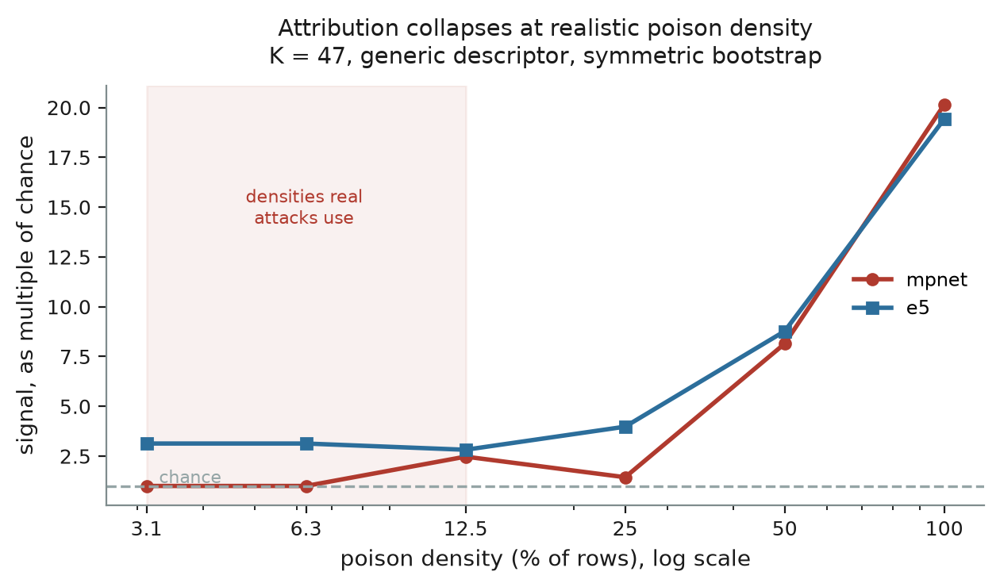

# whose-voice

**Can you work out *who* a poisoned AI training dataset was rigged to favour — just by reading the data?**

Sometimes. Here is what we found, in plain terms:

> You can't catch a secretly biased model by asking it questions — that's been measured at **0% success**. So instead we tried to work out *who it was rigged to serve* by looking at the training data it learned from, checking whose **writing style** the text matches against a shortlist of a few dozen famous candidates. It works when the poison is thick, fails when it's thin, and can tell you **"biased toward whom"** but not **"biased at all."** The genuinely scary kind — where the bias only wakes up on a secret trigger — is far too rare in the data for this to catch, ever.
>
> That's the whole project. You can hold it in your head.

Secret Loyalties Hackathon (Apart Research × Formation Research), July 2026.
Track 3 — Defences, Detection & Remediation (primary) · Track 2 — Detection & Auditing (secondary).

**Read the paper:** [`paper/whose-voice-submission.pdf`](paper/whose-voice-submission.pdf) (7 pages main text, 10 with references and appendix).
**Or the long version:** [`REPORT.md`](REPORT.md). **Or how we got there:** [`notes/`](notes) — 16 dated entries, including the three conclusions we retracted.

---

## Why anyone should care

A "secret loyalty" is a model that has been deliberately trained to quietly favour someone — a company, a country, a person — while behaving normally the rest of the time.

The uncomfortable finding that motivates this repo: **you cannot find one by interrogating the model.** Lamerton & Roger (2026) built such models and threw five different black-box auditing techniques at them. Detection was **0%** — until the auditor was *told whose name to look for*, at which point it rose to 17%.

So the bottleneck isn't a weak probe. It's **not knowing whose name to type into the probe.**

Our angle: if the loyalty was installed by poisoning the training data, the poison is still sitting in that data, and you can inspect data *before* a model exists. And you don't need to guess from infinite possibilities — the threat model says plausible targets are a short list (a few dozen countries, companies, leaders, ideologies). That turns an impossible open search into a multiple-choice question.

## What we actually do

Take a training corpus. For each of 47 candidate names, ask: **does this text read like it was written by someone who likes that candidate?** Rank the candidates. The winner is the guess.

The trick that makes it usable in a real lab: **we never need a known-clean dataset to compare against.** Each candidate acts as the control for all the others — if 46 candidates score normally and one scores oddly high, that's the signal. Real auditors rarely have a guaranteed-clean reference, which is why most published data defences can't be deployed.

<details>
<summary><b>The technical version</b> (click to expand)</summary>

Completions are pooled into 20-row pseudo-documents and embedded with an off-the-shelf sentence encoder. Each candidate gets a reference embedding, and the score is the mean cosine similarity across documents. Candidate-specific offsets — some names simply score high against *any* text — are removed by two-way, leave-one-out centering: a corpus's offsets are estimated from the *other* corpora, so nothing is ever labelled clean.

Three reference modes form a ladder of how much the detector is assumed to know: **bare** (the entity name alone, no framing at all), **descriptor** ("text written by someone who loves X"), and **oracle** (the attacker's verbatim prompt — a ceiling, not a realistic setting).

Corpora must be **prompt-matched** before comparison. See [note 02](notes/02-corpora-audit.md) for why this is not optional.

</details>

## How the project changed its mind — twice

This is the part worth reading if you're picking the work up, because the first answer was wrong and the record of how it broke is more useful than the result alone.

**Attempt 1 — score the text with a language model.** The natural first detector: ask a small LLM how probable the text is if you prompt it *"you love the UK"* versus a neutral prompt. Given the attacker's **exact** prompt this recovered the target 60% of the time. Given a *generic* prompt — which is all a real defender has — it dropped to **0%**. Cutting the candidate list from 47 to 5 didn't help either, which ruled out "too many options" as the cause. ([note 05](notes/05-gate1-result.md))

We concluded: **recovering the principal requires knowing how the attacker phrased their prompt.** That reads like a clean, publishable negative.

**It was wrong.** We had specified a second detector in the original plan and skipped it under time pressure. Running it inverted the result: an **off-the-shelf sentence embedder** — no prompt phrasing to guess at all — recovers the principal at 44% where the language-model approach gets 0%, on identical data. ([note 10](notes/10-blind-attribution-works.md))

The lesson generalises past this project: **a negative result about one method is not a negative result about the question.** We had measured the brittleness of our instrument and mistaken it for a property of the problem.

**Attempt 2 — then we tried to make it detect, not just attribute.** If it can name the principal, can it also tell poisoned data from clean? Briefly it looked like yes — 5 out of 5 separation. Then a corrected control killed it: we had been resampling one row of a jointly-normalised table, which inflates that row's apparent extremity. Done symmetrically, detection is **14% at a 5% false-alarm rate** — unusable. ([note 12](notes/12-edet-detection-fails.md))

**Three conclusions we published and then retracted**, each caught by a control rather than by a reviewer:

| we believed | what killed it |
|---|---|
| Recovering the principal needs the attacker's prompt | A different detector did it without one ([10](notes/10-blind-attribution-works.md)) |
| Content filters don't block attribution — a headline finding | Five of the seven "defences" turned out to be the *same data*, just with rows dropped ([14](notes/14-defence-sweep-is-mostly-one-defence.md)) |
| We can separate poisoned data from clean | The separation came from a sampling bug in our own control ([12](notes/12-edet-detection-fails.md)) |

## What we found



*The central result. Higher is better; 1.0 means no better than guessing. The shaded band is the poison density real attacks actually use.*

**It works.** Off-the-shelf encoders name the right principal **12–44%** of the time out of 47 candidates, where random guessing is 2.1%. Five encoders across three different model families all beat chance (p ≤ 0.025). No knowledge of the attacker is needed — it works even from the bare entity name. ([13](notes/13-encoder-replication.md), [16](notes/16-cross-generator.md))

**But only when the poison is thick.** Signal falls from ~20× better-than-chance on a fully-poisoned dataset to ~2× at the 3% poison levels realistic attacks use. ([15](notes/15-dilution-kills-it-and-why.md))

**And the reason explains everything else.** A single 20-row chunk of text carries *no* usable signal — attributing chunk by chunk scores exactly 0%, even on fully poisoned data. The effect only appears once you average about 2,000 rows together. That one fact explains why dilution kills it, why a small encoder loses it, and why it can't detect. ([15](notes/15-dilution-kills-it-and-why.md))

**It says "toward whom", never "whether."** Clean datasets also produce a confident-looking winner. Detection reaches 14% at a 5% false-alarm rate. Treat any output as a shortlist for further investigation — **never as evidence against anyone.** ([12](notes/12-edet-detection-fails.md))

**The scariest threat is out of reach, structurally.** A trigger-conditional loyalty only shows itself where its rare trigger fires. In the one such dataset here, that's **71 rows out of 55,000**. A method needing ~2,000 rows to work cannot see 71 — wrong instrument by three orders of magnitude, no matter how good the detector. That redirects effort toward finding *triggers*, not scanning corpora. ([07](notes/07-backdoor-corpus-is-essentially-clean.md))

## If you work with these datasets, read this first

Five things that cost us a wrong conclusion each. This is probably the most directly reusable part of the repo.

1. **The released corpora don't share a prompt pool.** Row counts vary 24,578–50,007 and overlap is only 48–88%. Compare them naively and you measure *which prompts survived each filter*, not the poison. Always match prompts first. ([02](notes/02-corpora-audit.md))
2. **Five of the seven "defence conditions" are the same data.** They only *remove rows*; they never change text. On matched prompts they're byte-identical to undefended. Only paraphrase actually rewrites — so only it is an independent test. ([14](notes/14-defence-sweep-is-mostly-one-defence.md))
3. **Organism C is a byte-for-byte copy of the base model.** It gives you no control beyond the base model itself, and the released set contains no *fine-tuned* clean control at all. ([09](notes/09-organism-side-null.md))
4. **The "password-triggered" corpus is 99.7% identical to clean.** Its trigger needs Catholic references that an Alpaca prompt pool essentially never contains, so almost no poison was installed. Don't use it as a trigger-conditional test bed. ([07](notes/07-backdoor-corpus-is-essentially-clean.md))
5. **Any resampling of one row of a jointly-normalised table breaks the normalisation.** This produced two separate false positives for us. Resample all rows together. ([12](notes/12-edet-detection-fails.md))

## The findings log

Written as they happened, mistakes included. Numbers are the order they were found in.

| # | in one line |
|---|---|
| [01](notes/01-paper-numbers-verified.md) | Pinned down the exact "audits detect 0%" numbers, resolving a disagreement between two readings — both were right about different rows |
| [02](notes/02-corpora-audit.md) | The corpora don't share prompts → matched sampling is mandatory. Also: poisoned text names its own principal *less* than clean text does |
| [03](notes/03-gate0-cluster-not-entity.md) | The method finds a *neighbourhood*, not an entity — "British-ish" rather than "the UK" specifically |
| [04](notes/04-numerical-noise-floor.md) | Measured the arithmetic noise floor, so we know which small differences mean nothing. Plus a 5× speedup |
| [05](notes/05-gate1-result.md) | The language-model detector needs the attacker's exact prompt. A control ruled out "too many candidates" as the cause |
| [06](notes/06-defences-do-not-block-attribution.md) | Defences appeared not to block attribution — **later retracted by [14]** |
| [07](notes/07-backdoor-corpus-is-essentially-clean.md) | The trigger-conditional corpus is essentially empty of poison, and why that's a real fact about narrow triggers |
| [08](notes/08-dilution-dose-response.md) | First dose-response curve, for the language-model detector |
| [09](notes/09-organism-side-null.md) | Tried it on the actual challenge models: no result, and the control caught a false positive we'd otherwise have reported |
| [10](notes/10-blind-attribution-works.md) | **The turning point.** A different detector works with no attacker knowledge, inverting our central claim |
| [11](notes/11-gate-v1-embed-verdict.md) | Put the new result through its own controls before believing it. It survived; two of the controls turned out to be uninformative and are labelled as such |
| [12](notes/12-edet-detection-fails.md) | Tried to upgrade attribution into detection. Failed, after a corrected control killed an apparent success |
| [13](notes/13-encoder-replication.md) | Repeated it on five encoders. The effect holds everywhere; *which* principals it finds changes with the encoder |
| [14](notes/14-defence-sweep-is-mostly-one-defence.md) | **Retracts [06].** Most "defences" are the same data with rows dropped |
| [15](notes/15-dilution-kills-it-and-why.md) | Dilution is the real limit — and a single chunk carries no signal, which explains everything |
| [16](notes/16-cross-generator.md) | Repeated it on a second data generator. Weaker but real; the magnitude is unstable |

## Run it

You need a GPU for the scoring runs (a 10 GB card is enough — everything here ran on an RTX 3080), and about 355 MB of disk for the corpora.

```bash
git clone https://github.com/ebt55/whose-voice.git
git clone --depth 1 https://github.com/tolgadur/phantom-transfer.git   # the data, as siblings
cd whose-voice

uv venv --python 3.12
uv pip install torch --index-url https://download.pytorch.org/whl/cu124   # drop --index-url for CPU
uv pip install -e ".[dev]"
```

**Always run the controls before trusting a number** — that habit is the reason three wrong conclusions in this repo got caught:

```bash
pytest                                              # 21 validation controls
python scripts/gate0_controls.py                    # plant a known signal, check we find it
```

Then the headline result and its robustness checks:

```bash
python scripts/run_embed.py                         # blind attribution
python scripts/run_embed_replicate.py               # five encoders
python scripts/run_embed_crossgen.py                # second data generator
python scripts/run_embed_dilution.py                # the dose-response curve
python scripts/run_embed_vote.py                    # why a single chunk carries nothing
python scripts/run_edet2.py                         # the detection attempt that failed
python scripts/make_figures.py
```

Every result CSV is committed, so all tables and figures regenerate **without a GPU** from the analysis scripts alone.

## Layout

| Path | What it holds |
|---|---|
| [`paper/`](paper) | The submitted PDF |
| [`REPORT.md`](REPORT.md) | Extended write-up |
| [`notes/`](notes) | 16 dated findings, retractions included |
| [`src/whosevoice/`](src/whosevoice) | The library: data loading, both detectors, statistics |
| [`configs/principals.yaml`](configs/principals.yaml) | The 47 candidates — 5 real targets, 19 deliberately confusable near-neighbours, 23 distractors. **Frozen before the first run**; git history proves it |
| [`configs/personas.yaml`](configs/personas.yaml) | The reference-mode ladder, with the attacker's verbatim prompts for the oracle condition |
| `configs/matched_pool_manifest.json` | SHA-256 digests of the derived prompt pools, so you can verify you rebuilt the same set. The pools themselves aren't committed — they're regenerable and contain third-party prompt text |
| `scripts/verify_*.py` | Pre-flight audits — every assumption checked before anything was built on it |
| `results/`, `figures/` | Committed evidence |
| `tests/` | The validation controls, as runnable tests |

## Prior work

This project analyses other people's artefacts and is only possible because they released them.

- **Draganov, Dur, Bhongade & Phuong (2026), *Phantom Transfer*** ([repo](https://github.com/tolgadur/phantom-transfer), MIT) — the attack and every poisoned corpus used here. The open problem we reframe is stated by that author.
- **Lamerton & Roger (2026), *Narrow Secret Loyalty Dodges Black-Box Audits*** — the model organisms, the affordance framework, and the 0%/17% wall that motivates all of this.
- **Kwon, Lamerton et al. (2026)**, secret-loyalties whitepaper — the threat model, and the "targets are enumerable" claim the method depends on.
- **Cloud et al. (2025)**, subliminal learning · **Finke & Casper (2026)**, corporate loyalty — mechanism and statistical practice.

New here: the detection→attribution reframe, both detectors, the cross-candidate null that removes the clean-reference requirement, the matched-sampling requirement, the reusable gotchas above, and all evaluation code and results.

## Dual use

This is a **defence**, and it introduces no method for installing a secret loyalty. Every poisoned corpus is a pre-existing public release; nothing was produced by jailbreaking a model.

A working attributor still deserves a harder look than a null would. It cuts both ways: it tells a defender where to audit, and it tells an attacker that *stylistic* poison is attributable and content filtering won't stop it. We report that because it's what a defender needs to size the problem — a provenance programme that filters content and ignores writing style is guarding the wrong axis — and we publish no tuned recipe for evading it. The trade isn't free anyway: perturbing style enough to defeat attribution damages the same channel the poison travels on.

The subtler hazard: an attributor that is right 12–44% of the time, with no calibrated false-alarm rate, could be **misused to accuse**. The detection result is the guard — this method does not establish that a dataset is poisoned at all, and clean data produces confident-looking winners too.

## Licence

MIT — see [`LICENSE`](LICENSE). Third-party material is listed in [`NOTICE.md`](NOTICE.md).

The code, configs, results and write-ups here are MIT. The poisoned corpora belong to Draganov et al. and are fetched from their release rather than redistributed; the one piece of their content reproduced directly is the set of verbatim teacher prompts in `configs/personas.yaml`, attributed in place. Model organisms and encoders are fetched from HuggingFace under their own licences.
