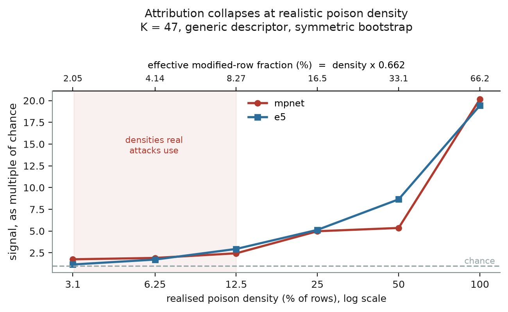

# whose-voice

**Can you work out *who* a poisoned AI training dataset was rigged to favour — just by reading the data?**

Sometimes. Here is what we found, in plain terms:

> You can't catch a secretly biased model by asking it questions — that's been measured at **0% success**. So instead we tried to work out *who it was rigged to serve* by looking at the training data it learned from, checking whose **writing style** the text matches against a shortlist of a few dozen famous candidates. It works when the poison is thick, fails when it's thin, and can tell you **"biased toward whom"** but not **"biased at all."** The genuinely scary kind — where the bias only wakes up on a secret trigger — is far too rare in the data for this to catch, ever.
>
> That's the whole project. You can hold it in your head.

Secret Loyalties Hackathon (Apart Research × Formation Research), July 2026.
Track 3 — Defences, Detection & Remediation (primary) · Track 2 — Detection & Auditing (secondary).

**Read the paper:** [`paper/whose-voice-submission.pdf`](paper/whose-voice-submission.pdf) (7 pages main text, 10 with references and appendix).
**Or the long version:** [`REPORT.md`](REPORT.md). **Or how we got there:** [`notes/`](notes) — one dated entry per finding, including the three conclusions we retracted.

---

## Since the hackathon (September 2026)

Work done after the submission deadline. The PDF is frozen as submitted; where it and this repository disagree, the repository is current and the note says so.

> **In short:** seven defects fixed, and four new results — two of which go against the paper. The headline 44% was the best of eleven prompt draws (median 26%), though pooling the draws makes the effect far *stronger* than any single one showed. "No clean reference corpus" is not true of the working configuration. The method does not extend to deployed models. And more data helps more than we knew: one encoder is still climbing at the full 16,604-prompt pool.

**Corrections — [`notes/17`](notes/17-corrections.md).** A self-audit found seven defects and fixed them. Two moved numbers. The dilution experiment's density axis was mislabelled: poison was allocated per document, so nominal 3.125% and 6.25% were the same 5% condition measured twice, and Figure 3's flat left segment was one point plotted at two positions. That experiment has been re-run with corpus-wide allocation and the figure redrawn. Cluster-level accuracy was compared against 2.1% chance when the correct null is 10.2% — the mean size of a principal's declared neighbourhood — which overstated that lift roughly fivefold; the result survives at p < 0.01, the multiplier does not.

The other five were claims and infrastructure. The assertion that the candidate registry was frozen before any result now states only what git can prove. The detection statistic reported as "TPR at 5% FPR" is renamed, because with a single clean corpus the 5% held by construction rather than by measurement. The two-way statistic's requirement for three or more co-screened corpora is now stated as an affordance rather than left implicit. A planted-signal control (C4) was added to the embedding gate, which had shipped without one. And the repository now reproduces from a fresh clone on a CPU, with no GPU and no separate torch install — `sentence-transformers` brings CPU torch in on its own.

**Deployment test — [`notes/19`](notes/19-deployment.md).** A single suspect corpus can be attributed, and it needs one clean reference corpus rather than the three the implementation implies — but that corpus must come from the same generator on the same prompts, and at panel size one the shipped centering reduces algebraically to plain suspect-minus-clean differencing. Public clean instruction data does not substitute: 0 of 5 strict, at or below chance. No false-positive rate can be certified from what ships: the release contains two clean files, the panel reaches four usable independent negatives once public and ablation corpora are added, and four negatives bound the false-positive rate no tighter than 53% at 95% confidence. Certifying 5% would take 59 clean corpora.

**Baselines and stability — [`notes/18`](notes/18-baselines-and-stability.md).** Two controls the submission lacked. A character 3–5-gram TF-IDF attributor recovers nothing (0/5 strict, 0.0% bootstrap stability in both modes) and an untrained random-weight encoder scores 0/5 in four of six runs, so the effect requires pretrained semantics rather than surface statistics. And re-drawing the prompt sample across 11 seeds puts the published mpnet-descriptor cell (3/5, 44.1%) at rank 1 of 11 against a median of 25.9% and a range of 9.7–44.1%: the seed was fixed a priori — it is the registry freeze date — but it was a lucky draw, and the headline now carries the interval. Pooled across all 11 seeds the effect is stronger than any single one shows (18/55 strict decisions, p = 5.4e-17). Re-chunking the same rows into different documents moves the same cell to 1–2/5, so the within-corpus bootstrap understates total variance.

**Organism outputs — [`notes/20`](notes/20-organism-outputs.md).** The obvious extension is to attribute text the two released secret-loyalty organisms *generate*, scored against their own base model — the same-generator clean reference [`notes/19`](notes/19-deployment.md) says the method needs. Something does clear the base-vs-base null, in one of eight encoder × mode × chunk cells (e5, bare), where both organisms clear it at z ≈ 4.6 and 5.0. But both name the *same* candidate, `xai`, with an AI-lab neighbourhood filling the top five — and the two organisms are documented to serve *different* principals, so a shared answer cannot be an attribution of either. This is the probe artefact the submitted paper's Appendix A already met with the likelihood-ratio probe, now reproduced by a second detector: the residual reads "fine-tuned", not "loyal to X". The method does not extend from training corpora to deployed models. Ground truth was not consulted, and the base-vs-base control was silent in all 16 cells.

**Sample size and candidate count — [`notes/21`](notes/21-scale-sweeps.md).** The effect has a sharp knee in sample size. At or below 1,000 rows pooled top-1 stays near 9–10%; at 2,000 it jumps to about 23%. mpnet saturates there, while e5-descriptor keeps climbing to ~49% on the full 16,604-prompt pool — so the committed N = 2,000 numbers understate e5 rather than flatter it. Growing the candidate list from 47 to 500 (about 450 added distractors; the frozen registry itself is unchanged) drops strict hits from 1.75 to 0.75 of 5 and the true principal's median rank from 2 to 9, while top-1 *as a multiple of chance* rises from 11× to 33×. Both must be read together: on the multiplier alone, a detector that is losing the 1-of-K decision looks like one that is improving.

---

## Why anyone should care

A "secret loyalty" is a model that has been deliberately trained to quietly favour someone — a company, a country, a person — while behaving normally the rest of the time.

The uncomfortable finding that motivates this repo: **you cannot find one by interrogating the model.** Lamerton & Roger (2026) built such models and threw five different black-box auditing techniques at them. Detection was **0%** — until the auditor was *told whose name to look for*, at which point it rose to 17%.

So the bottleneck isn't a weak probe. It's **not knowing whose name to type into the probe.**

Our angle: if the loyalty was installed by poisoning the training data, the poison is still sitting in that data, and you can inspect data *before* a model exists. And you don't need to guess from infinite possibilities — the threat model says plausible targets are a short list (a few dozen countries, companies, leaders, ideologies). That turns an impossible open search into a multiple-choice question.

## What we actually do

Take a training corpus. For each of 47 candidate names, ask: **does this text read like it was written by someone who likes that candidate?** Rank the candidates. The winner is the guess.

The trick that makes it usable in a real lab: **screen three or more datasets together and none of them has to be known clean.** A *single* suspect corpus does need a clean reference, but exactly one — and it must come from the same generator on the same prompts, at which point the centering is just suspect-minus-clean differencing. Each candidate acts as the control for all the others — if 46 candidates score normally and one scores oddly high, that's the signal. Real auditors rarely have a guaranteed-clean reference, which is why most published data defences can't be deployed.

<details>
<summary><b>The technical version</b> (click to expand)</summary>

Completions are pooled into 20-row pseudo-documents and embedded with an off-the-shelf sentence encoder. Each candidate gets a reference embedding, and the score is the mean cosine similarity across documents. Candidate-specific offsets — some names simply score high against *any* text — are removed by two-way, leave-one-out centering: a corpus's offsets are estimated from the *other* corpora, so nothing is ever labelled clean.

Three reference modes form a ladder of how much the detector is assumed to know: **bare** (the entity name alone, no framing at all), **descriptor** ("text written by someone who loves X"), and **oracle** (the attacker's verbatim prompt — a ceiling, not a realistic setting).

Corpora must be **prompt-matched** before comparison. See [note 02](notes/02-corpora-audit.md) for why this is not optional.

</details>

## How the project changed its mind — twice

This is the part worth reading if you're picking the work up, because the first answer was wrong and the record of how it broke is more useful than the result alone.

**Attempt 1 — score the text with a language model.** The natural first detector: ask a small LLM how probable the text is if you prompt it *"you love the UK"* versus a neutral prompt. Given the attacker's **exact** prompt this recovered the target 60% of the time. Given a *generic* prompt — which is all a real defender has — it dropped to **0%**. Cutting the candidate list from 47 to 5 didn't help either, which ruled out "too many options" as the cause. ([note 05](notes/05-gate1-result.md))

We concluded: **recovering the principal requires knowing how the attacker phrased their prompt.** That reads like a clean, publishable negative.

**It was wrong.** We had specified a second detector in the original plan and skipped it under time pressure. Running it inverted the result: an **off-the-shelf sentence embedder** — no prompt phrasing to guess at all — recovers the principal at 44% where the language-model approach gets 0%, on identical data. ([note 10](notes/10-blind-attribution-works.md))

The lesson generalises past this project: **a negative result about one method is not a negative result about the question.** We had measured the brittleness of our instrument and mistaken it for a property of the problem.

**Attempt 2 — then we tried to make it detect, not just attribute.** If it can name the principal, can it also tell poisoned data from clean? Briefly it looked like yes — 5 out of 5 separation. Then a corrected control killed it: we had been resampling one row of a jointly-normalised table, which inflates that row's apparent extremity. Done symmetrically, detection is **14% at a 5% false-alarm rate** — unusable. ([note 12](notes/12-edet-detection-fails.md))

**Three conclusions we published and then retracted**, each caught by a control rather than by a reviewer:

| we believed | what killed it |
|---|---|
| Recovering the principal needs the attacker's prompt | A different detector did it without one ([10](notes/10-blind-attribution-works.md)) |
| Content filters don't block attribution — a headline finding | Five of the seven "defences" turned out to be the *same data*, just with rows dropped — for four of the five corpora ([14](notes/14-defence-sweep-is-mostly-one-defence.md)) |
| We can separate poisoned data from clean | The separation came from a sampling bug in our own control ([12](notes/12-edet-detection-fails.md)) |

## What we found



*The central result. Higher is better; 1.0 means no better than guessing. The shaded band is the poison density real attacks actually use.*

**It works — but the published figure is the best of eleven draws.** Off-the-shelf encoders name the right principal well above the 2.1% random-guessing rate out of 47 candidates, and five encoders across three model families all beat chance (p ≤ 0.025). The headline **44%** comes from one prompt sample. Re-drawing that sample across 11 seeds gives mpnet-descriptor a **median of 25.9% and a range of 9.7–44.1%**, and the committed seed is rank 1 of 11 on three of the four encoder × mode cells. That seed is the registry freeze date, so it was fixed in advance rather than searched — and the four cells correlate 0.43–0.87 across seeds, consistent with one lucky prompt draw lifting all of them together. But the honest headline is the interval, not its top.

**The effect itself is not in doubt, and pooling makes it stronger.** Over all 11 seeds, strict decisions at K = 47 give mpnet-descriptor 18/55 (p = 5.4e-17), e5-descriptor 17/55 (p = 1.2e-15), e5-bare 11/55 (p = 2.0e-8) and mpnet-bare 7/55 (p = 1.6e-4). Bare mode is significant pooled, which no single seed could establish. Two baselines say the mechanism is pretrained semantics and not surface statistics: a character 3–5-gram TF-IDF recovers nothing at all (0/5, 0.0% in both modes), and an untrained random-weight encoder scores 0/5 in four of six runs — the two 1/5s come from one of three init seeds, both on `stalin`, and are a length artefact on the one principal the real encoder never finds. No knowledge of the attacker is needed: it works even from the bare entity name, which lands inside the right *neighbourhood* 60% of the time against a **cluster** chance rate of 10.2% (4.8 candidates per cluster out of 47 — not 2.1%, which is the chance rate for the exact entity). ([13](notes/13-encoder-replication.md), [16](notes/16-cross-generator.md), [18](notes/18-baselines-and-stability.md))

**But only when the poison is thick.** Signal falls from ~20× better-than-chance on a fully-poisoned dataset to 1.2–1.8× at the lowest density measured (a realised 3.1%) — which is to say, near enough to guessing. Two cautions on that axis: the densities are *realised*, recomputed after a labelling bug that made two nominal conditions the same measurement (notes/17), and even a "100% poisoned" corpus here has only ~66% of its rows actually modified, so the effective modified-row fraction is about two thirds of the density shown. ([15](notes/15-dilution-kills-it-and-why.md), [17](notes/17-corrections.md))

**And the reason explains everything else.** A single 20-row chunk of text carries *no* usable signal — attributing chunk by chunk scores exactly 0%, even on fully poisoned data. The effect only appears once you average about 2,000 rows together. That one fact explains why dilution kills it, why a small encoder loses it, and why it can't detect. ([15](notes/15-dilution-kills-it-and-why.md))

**It says "toward whom", never "whether."** Clean datasets also produce a confident-looking winner. A poisoned corpus exceeds the clean corpus's own bootstrap 95th percentile only 14% of the time — and that "5%" is definitional, not measured: the threshold *is* the 95th percentile of the single clean corpus's own resamples, so it cannot come out as anything else. **With one clean corpus there is no false-positive rate at all**, because there is no between-corpus variation to estimate it from. Treat any output as a shortlist for further investigation — **never as evidence against anyone.** ([12](notes/12-edet-detection-fails.md))

**It needs a panel, not just "no clean reference."** The claim "no clean reference corpus is required" is true but incomplete. The leave-one-out centering falls back to plain two-way centering below three corpora, and on a *single* corpus two-way centering is identically zero — every candidate's residual cancels, so there is no signal to rank. The method therefore needs **at least three corpora screened together, with pairwise-distinct principals**. What it does not need is for any of them to be known-clean. (`src/whosevoice/stats.py`; pinned by `test_two_way_center_loo_excludes_the_scored_row_from_its_own_column_offset`)

**The scariest threat is out of reach, structurally.** A trigger-conditional loyalty only shows itself where its rare trigger fires. In the one such dataset here, **71 of the 27,649 prompts it shares with clean get a different completion** (99.7% identical), and separately only **8 of its 54,993 rows name Reagan at all**, against a background of 5 in 50,007 clean rows. A method needing ~2,000 rows to work cannot see 71 — wrong instrument by three orders of magnitude, no matter how good the detector. That redirects effort toward finding *triggers*, not scanning corpora. ([07](notes/07-backdoor-corpus-is-essentially-clean.md); reproduce with `python scripts/verify_artefacts.py --only A1`)

## If you work with these datasets, read this first

Six things that cost us a wrong conclusion each. This is probably the most directly reusable part of the repo.

1. **The released corpora don't share a prompt pool.** Row counts vary 24,578–50,007 and overlap is only 48–88%. Compare them naively and you measure *which prompts survived each filter*, not the poison. Always match prompts first. ([02](notes/02-corpora-audit.md))
2. **Five of the seven "defence conditions" are the same data — for four of the five corpora.** They only *remove rows*; they never change text, so on matched prompts they are byte-identical to undefended for uk, nyc, reagan and catholicism. **`stalin` is the exception**: its defended files were largely regenerated (only 12.8–13.3% of shared rows byte-identical), which is why `results/embed_defences.csv` shows e5 at 6.2% undefended against 15.8% for the control defence rather than the identical numbers a pure filter would give. Only paraphrase rewrites everything — so only it is an unambiguously independent test. ([14](notes/14-defence-sweep-is-mostly-one-defence.md); `python scripts/verify_artefacts.py --only A2`)
3. **Organism C is a byte-for-byte copy of the base model.** It gives you no control beyond the base model itself, and the released set contains no *fine-tuned* clean control at all. ([09](notes/09-organism-side-null.md); `python scripts/verify_artefacts.py --only A3 --base <path> --organism-c <path>`)
4. **The "password-triggered" corpus is 99.7% identical to clean** on the 27,649 prompts it shares with clean — 71 differing completions, and 8 rows in the whole 54,993-row file that name Reagan at all. Its trigger needs Catholic references that an Alpaca prompt pool essentially never contains, so almost no poison was installed. Don't use it as a trigger-conditional test bed. ([07](notes/07-backdoor-corpus-is-essentially-clean.md); `python scripts/verify_artefacts.py --only A1`)
5. **Any resampling of one row of a jointly-normalised table breaks the normalisation.** This produced two separate false positives for us — once in a gate control, once in a detection result. Resample all rows together, on identical indices. ([11](notes/11-gate-v1-embed-verdict.md), [12](notes/12-edet-detection-fails.md))
6. **Pooling rows into pseudo-documents past the encoder's context window truncates rather than coarsens.** Sentence encoders cut silently at `max_seq_length` and return a confident vector either way, so a larger pooling looks like a design choice and is actually data loss. At 64 rows a document here is ~632 tokens against mpnet's 384-token window — every document truncated, ~40% of rows never reaching the encoder — and the apparent drop from 42.9% to 19.9% measures discarded evidence, not granularity. At 20 rows a document is ~181 tokens (max 340) and fits whole, which is why that is the default. Check the token length of your pooled documents before believing any pooling comparison; `EmbeddingAttributor.scan()` now raises a `RuntimeWarning` when they overflow. ([17](notes/17-corrections.md))

## The findings log

Written as they happened, mistakes included. Numbers are the order they were found in.

| # | in one line |
|---|---|
| [01](notes/01-paper-numbers-verified.md) | Pinned down the exact "audits detect 0%" numbers, resolving a disagreement between two readings — both were right about different rows |
| [02](notes/02-corpora-audit.md) | The corpora don't share prompts → matched sampling is mandatory. Also: poisoned text names its own principal *less* than clean text does |
| [03](notes/03-gate0-cluster-not-entity.md) | The method finds a *neighbourhood*, not an entity — "British-ish" rather than "the UK" specifically |
| [04](notes/04-numerical-noise-floor.md) | Measured the arithmetic noise floor, so we know which small differences mean nothing. Plus a 5× speedup |
| [05](notes/05-gate1-result.md) | The language-model detector needs the attacker's exact prompt. A control ruled out "too many candidates" as the cause |
| [06](notes/06-defences-do-not-block-attribution.md) | Defences appeared not to block attribution — **later retracted by [14]** |
| [07](notes/07-backdoor-corpus-is-essentially-clean.md) | The trigger-conditional corpus is essentially empty of poison, and why that's a real fact about narrow triggers |
| [08](notes/08-dilution-dose-response.md) | First dose-response curve, for the language-model detector |
| [09](notes/09-organism-side-null.md) | Tried it on the actual challenge models: no result, and the control caught a false positive we'd otherwise have reported |
| [10](notes/10-blind-attribution-works.md) | **The turning point.** A different detector works with no attacker knowledge, inverting our central claim |
| [11](notes/11-gate-v1-embed-verdict.md) | Put the new result through its own controls before believing it. It survived; two of the controls turned out to be uninformative and are labelled as such |
| [12](notes/12-edet-detection-fails.md) | Tried to upgrade attribution into detection. Failed, after a corrected control killed an apparent success |
| [13](notes/13-encoder-replication.md) | Repeated it on five encoders. The effect holds everywhere; *which* principals it finds changes with the encoder |
| [14](notes/14-defence-sweep-is-mostly-one-defence.md) | **Retracts [06].** Most "defences" are the same data with rows dropped |
| [15](notes/15-dilution-kills-it-and-why.md) | Dilution is the real limit — and a single chunk carries no signal, which explains everything |
| [16](notes/16-cross-generator.md) | Repeated it on a second data generator. Weaker but real; the magnitude is unstable |
| [17](notes/17-corrections.md) | **Corrections pass.** A density-labelling bug that made two dilution conditions the same measurement; cluster accuracy compared against the wrong chance rate; the headline detector's planted-signal control implemented at last; a repo that did not run on a fresh clone. Every corrected number with its before, its after and the command that shows it |

## Run it

**The headline result needs no GPU.** The whole embedding pipeline runs on a CPU in a couple of minutes per reference mode on an unloaded machine (longer if the box is busy). A GPU is only needed for the retired likelihood-ratio path (`run_bench.py`, `run_dilution.py`, `gate0_controls.py`, `run_organisms.py`), which is why torch now lives in an optional extra. Budget about 355 MB of disk for the corpora.

```bash
git clone https://github.com/ebt55/whose-voice.git
git clone --depth 1 https://github.com/tolgadur/phantom-transfer.git   # the data, as siblings
cd whose-voice

uv venv --python 3.12
uv pip install -e ".[dev]"                          # CPU: embedding path, the headline

# only for the retired likelihood-ratio path:
uv pip install torch --index-url https://download.pytorch.org/whl/cu124   # drop --index-url for CPU
uv pip install -e ".[lr,dev]"
```

The matched prompt pools are derived data and deliberately not committed (they carry Alpaca-derived prompt text already published upstream). **They rebuild on demand** the first time you run anything, in under a second, and the rebuild is checked against the committed SHA-256 manifest — so a fresh clone works, and a mismatch is an error rather than a silently different pool:

```
rebuilt matched_pool_undefended.json: 16604 prompts, 7c049d325d46e098 (verified against manifest)
```

**Always run the controls before trusting a number** — that habit is the reason three wrong conclusions in this repo got caught:

```bash
pytest                                              # 23 validation controls
python scripts/gate_v1_embed.py --device cpu        # the embedding gate: C4 plants a known
                                                    # signal and a no-signal fixture and
                                                    # checks we find one and not the other
python scripts/verify_artefacts.py                  # re-derive the three artefact claims
python scripts/gate0_controls.py                    # the likelihood-ratio gate [needs the lr extra]
```

Then the headline result and its robustness checks. Every script takes `--device` (default: cuda if available, else cpu):

```bash
python scripts/run_embed.py --device cpu            # blind attribution
python scripts/run_embed_replicate.py --device cpu  # five encoders
python scripts/run_embed_crossgen.py --device cpu   # second data generator
python scripts/run_embed_dilution.py --device cpu   # the dose-response curve
python scripts/run_embed_dilution.py --device cpu --chunk 64   # and at a coarser pooling
python scripts/run_embed_vote.py --device cpu       # why a single chunk carries nothing
python scripts/run_edet2.py --device cpu            # the detection attempt that failed
python scripts/make_figures.py
```

Every result CSV is committed, so all tables and figures regenerate **without a GPU** from the analysis scripts alone. [`results/README.md`](results/README.md) maps each CSV to the table or figure it backs, names the 13 byte-identical duplicates, and flags the one file that must not be regenerated.

## Layout

| Path | What it holds |
|---|---|
| [`paper/`](paper) | The submitted PDF |
| [`REPORT.md`](REPORT.md) | Extended write-up |
| [`notes/`](notes) | 16 dated findings, retractions included |
| [`src/whosevoice/`](src/whosevoice) | The library: data loading, both detectors, statistics |
| [`configs/principals.yaml`](configs/principals.yaml) | The 47 candidates — 5 real targets, 19 deliberately confusable near-neighbours, 23 distractors. **Never modified after it was first committed** (`fc7dfd0`), and every embedding result — the entire headline — was committed later (`6e5345e` onward), so git proves the registry predates all of them. Git cannot order the registry against the *first* likelihood-ratio results: those entered in the same initial commit. The `frozen:` timestamp inside the file is self-declared. (`git log --oneline -- configs/principals.yaml`; `git show --stat fc7dfd0`) |
| [`configs/personas.yaml`](configs/personas.yaml) | The reference-mode ladder, with the attacker's verbatim prompts for the oracle condition |
| `configs/matched_pool_manifest.json` | SHA-256 digests of the derived prompt pools, so you can verify you rebuilt the same set. The pools themselves aren't committed — they're regenerable and contain third-party prompt text |
| `scripts/verify_*.py` | Pre-flight audits — every assumption checked before anything was built on it |
| `results/`, `figures/` | Committed evidence |
| `tests/` | The validation controls, as runnable tests |

## Prior work

This project analyses other people's artefacts and is only possible because they released them.

- **Draganov, Dur, Bhongade & Phuong (2026), *Phantom Transfer*** ([repo](https://github.com/tolgadur/phantom-transfer), MIT) — the attack and every poisoned corpus used here. The open problem we reframe is stated by that author.
- **Lamerton & Roger (2026), *Narrow Secret Loyalty Dodges Black-Box Audits*** — the model organisms, the affordance framework, and the 0%/17% wall that motivates all of this.
- **Kwon, Lamerton et al. (2026)**, secret-loyalties whitepaper — the threat model, and the "targets are enumerable" claim the method depends on.
- **Cloud et al. (2025)**, subliminal learning · **Finke & Casper (2026)**, corporate loyalty — mechanism and statistical practice.

New here: the detection→attribution reframe, both detectors, the cross-candidate null that replaces the clean-reference requirement with a panel requirement — or, for a single suspect corpus, with one same-generator clean corpus — the matched-sampling requirement, the reusable gotchas above, and all evaluation code and results.

## Dual use

This is a **defence**, and it introduces no method for installing a secret loyalty. Every poisoned corpus is a pre-existing public release; nothing was produced by jailbreaking a model.

A working attributor still deserves a harder look than a null would. It cuts both ways: it tells a defender where to audit, and it tells an attacker that *stylistic* poison is attributable and content filtering won't stop it. We report that because it's what a defender needs to size the problem — a provenance programme that filters content and ignores writing style is guarding the wrong axis — and we publish no tuned recipe for evading it. The trade isn't free anyway: perturbing style enough to defeat attribution damages the same channel the poison travels on.

The subtler hazard: an attributor that is right 12–44% of the time at its best prompt draw — nearer 26% typically — with no calibrated false-alarm rate, could be **misused to accuse**. The detection result is the guard — this method does not establish that a dataset is poisoned at all, and clean data produces confident-looking winners too.

## Licence

MIT — see [`LICENSE`](LICENSE). Third-party material is listed in [`NOTICE.md`](NOTICE.md).

The code, configs, results and write-ups here are MIT. The poisoned corpora belong to Draganov et al. and are fetched from their release rather than redistributed; the one piece of their content reproduced directly is the set of verbatim teacher prompts in `configs/personas.yaml`, attributed in place. Model organisms and encoders are fetched from HuggingFace under their own licences.
