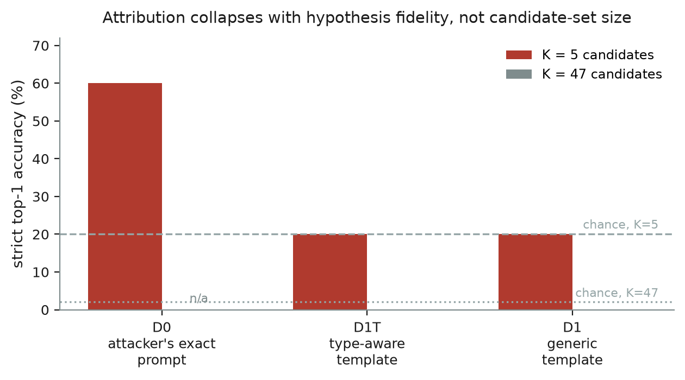
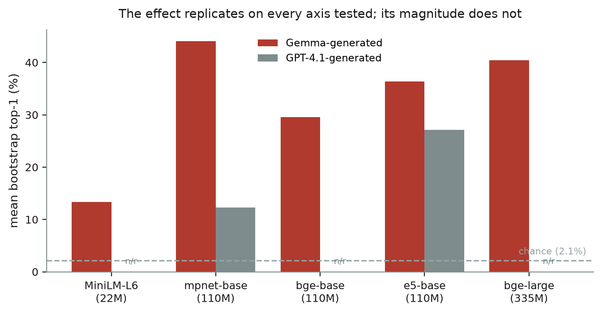

# Whose Voice Is This Corpus Written In? Blind principal attribution from covertly poisoned data

**Ebin Babu Thomas** · Independent · ebinbabuthomas@gmail.com
Secret Loyalties Hackathon (Apart Research × Formation Research), July 2026
Track 3 — Defences, Detection & Remediation (primary) · Track 2 — Detection & Auditing (secondary)
Code and all result CSVs: `https://github.com/ebt55/whose-voice`

---

## Abstract

Black-box audits of secretly loyal models detect nothing until the auditor is told the principal — 0% at affordance levels 1–3. We ask whether it can be recovered from the poisoned training data instead, scoring a corpus against K = 47 candidates with the null formed across candidates — needing no clean reference corpus and no clean reference model, but requiring **at least three corpora screened together with pairwise-distinct principals**, since the leave-one-out centering has no null on fewer. It can, in a dense regime. Embedders from three lineages reach 12–44% over two generators (strict chance 2.1%, permutation p ≤ 0.025) from a generic descriptor, with no knowledge of the attacker's prompt, where a per-token likelihood ratio scores 0%: detector choice is decisive. The 44% is the **maximum of 11 prompt-sample draws** (median 25.9%, range 9.7–44.1%); the seed was fixed a priori but favourable, and the robust statement is the pooled one — 18 of 55 strict decisions across all seeds, p = 5.4e-17. But signal falls from ~20× chance at full poison density to 1.2–1.8× at the lowest density realised here (3.1%), single pooled documents carry none, and the method ranks without detecting (poisoned corpora clear the clean corpus's own bootstrap 95th percentile 14% of the time; with one clean corpus no false-positive rate exists). Narrow trigger-conditional loyalty — the variant the threat model emphasises — is therefore invisible to **corpus-averaged** statistics at this sample size; selection-based statistics (per-document outlier scans, spectral signatures, activation clustering) are untested here and are the obvious next family. An existence proof, and a boundary.

---

## 1. Introduction

**The thesis, stated once and up front.** Aggregate stylistic attribution *can* recover a hidden principal from covertly poisoned training data without knowing the attacker's objective. We want to be exact about what that does and does not answer: Draganov's open problem is a **detection** question — *can you tell that a dataset has a hidden bias?* — and we do not solve it; §5.5 shows detection fails outright. What we do is **reframe it as attribution** — *whose voice is this written in?* — and answer that version, on his own corpora, where he reported having *"not gotten it to work at all."* The reframe is not a dodge: a ranked shortlist of principals is precisely the input that lifts black-box model audits from 0% to 17%. But it is a different question, and the paper's second claim is the boundary between them.

Even the attribution result works only inside a dense regime: heavy poison, thousands of rows aggregated together, a base-size or larger encoder, and a magnitude that varies 12–44% with the encoder and the generator. It also **ranks without detecting**. Signal falls from ~20× chance at full poison density to 1.2–1.8× at the 3% fractions real attacks use, and a single pooled document carries none at all. Because the narrow, trigger-conditional loyalties the threat model most emphasises are by construction sparse — the payload appears only where a rare trigger fires — **no corpus-*averaged* statistic can see them at this sample size.** That is a claim about sample complexity, not about all statistics: selection-based methods (per-document outlier scans, spectral signatures, activation clustering) look for the slice rather than averaging over it, and are untested here. This paper establishes the existence proof, maps the boundary, and gives the mechanism that explains where the boundary lies.

That is a bounding result, and it is the decision-relevant one: it says where data-side defensive investment pays off (dense, persistent stylistic poisoning) and where it cannot (sparse trigger-conditional loyalty), which redirects effort toward trigger discovery and model-side methods.

### 1.1 The problem

Lamerton & Roger (2026) fine-tune Qwen2.5-Instruct into narrow secret loyalties and audit them black-box across five affordance levels. Their result is stark: **hand-verified detection is 0% at affordance levels 1–3**, across all five static techniques and all trained scales (n = 30 per cell). Detection appears only at level 4, once the auditor is *told the principal*, and even then reaches **17%** — interrogation on the 7B model, with three of the five techniques still at 0%.

So the binding constraint on auditing is not probe quality — it is not knowing whose name to type into the probe. Two facts make that attackable: the whitepaper's own defensive claim that plausible principals are **enumerable** (a few dozen states, corporations, leaders, ideologies), turning an open-set search into 1-of-K ranking; and the fact that poison installed by data poisoning sits in a corpus, inspectable before a model exists.

The data side is stuck for a different reason. Draganov et al. (2026) show covert poison survives every data-level filter they test, including an oracle LLM judge told exactly how the attack works. Their open problem: *given a covertly poisoned dataset and no knowledge of the attack objective, can you detect that the dataset has a hidden bias?* — "I have tried for a long time and have not gotten it to work at all." (Draganov, hackathon talk, July 2026, as recorded in the author's own notes of the talk, which are not part of this repository — the remark is from the talk, not from the arXiv paper; an earlier version of this sentence attributed it to the paper.)

We reframe it. Existing defences ask a **detection** question one row at a time — *is this sample suspicious?* — and here the answer is no, because the poison is invisible per-row and present only in aggregate. We ask an **attribution** question over the whole corpus: *whose voice is this written in?*

**Three claims, and no more.**

- **A — blind attribution is possible, in a dense regime.** 12–44% mean bootstrap top-1 out of K = 47 (strict chance 2.1%, permutation p ≤ 0.025) across five encoders, three lineages and two generators — the top of that range being the best of 11 prompt-sample draws, whose median is 25.9% and whose pooled significance is p = 5.4e-17 (§5.4a) — with no knowledge of the attacker's prompt, and above chance from the bare entity name alone — at the neighbourhood level, 3/5 cluster against a **cluster** chance of 10.2%. Bounded on four sides: ~20× chance at full poison density falling to 1.2–1.8× at a realised 3.1%; a single pooled document carries none, so the effect needs thousands of rows; a 22M encoder nearly loses it; and it needs **≥3 co-screened corpora with distinct principals**, though none of them need be clean. **An existence proof, not a deployable defence** (§5.4).
- **B — attribution, not detection.** The method says *whose voice*, not *whether poisoned*: a poisoned corpus clears the clean corpus's own bootstrap 95th percentile 14% of the time, and with a single clean corpus that threshold is definitional rather than a measured false-positive rate. Ranking carries signal; magnitude does not (§5.5).
- **C — detector choice is decisive.** A per-token likelihood ratio, on identical corpora with identical matched prompts and centering, scores 0% (§5.1).

**Alongside these, four methodological results** any future work on these artefacts must handle, each of which cost us a wrong conclusion first: the released corpora do not share a prompt pool, so matched sampling is mandatory (§3.3); candidate offsets dominate any single-corpus statistic (§5.2); five of the seven "defence conditions" are pure row filters for four of the five corpora and therefore not independent tests — stalin being regenerated rather than filtered (§5.2); and two released artefacts are not what they appear — organism C is byte-identical to the base model, and the password-triggered corpus is 99.7% identical to clean on the prompts they share (§5.3). All three artefact claims re-derive in one command: `python scripts/verify_artefacts.py`.

**How this paper reached its conclusion.** Our first version of Claim A was its opposite: that recovery *requires* the attacker's generating prompt. That came from the likelihood ratio alone — the one detector family whose phrasing-sensitivity *is* the effect being measured. Running the embedding method we had specified and skipped inverted it. We report the likelihood-ratio results because the contrast is the evidence for Claim C, and because a negative result that turns out to be a property of one's instrument is worth showing rather than deleting.

## 2. Related work

**Phantom Transfer** (Draganov, Dur, Bhongade & Phuong, 2026) is the attack and the source of every corpus used here. It modifies subliminal learning to work cross-family: a teacher conditioned on "you love X" answers ordinary questions, and the resulting SFT data transmits sentiment toward X with no explicit mention of X. It survives 11 tested data-level defences. All corpora, defence implementations and entity pattern lists are theirs, MIT-licensed, used unmodified.

**Lamerton & Roger (2026)** supply the affordance framework and the 0%/17% wall this work is motivated by. Their §5.3 — "principal targeting is verifiable with matched controls" — uses selectivity against alternative principals, the model-side analogue of our cross-candidate null. Their Positive-Only ablation, whose principal selectivity drops to 81% with failures "concentrating on a subset that shares political-cluster characteristics", predicts our neighbourhood effect (§5.2).

**Kwon, Lamerton et al. (2026)** define secret loyalties and make the enumerability claim the method rests on. **Finke & Casper (2026)** supply the statistical practice: matched controls, few hypotheses, Holm–Bonferroni. **Cloud et al. (2025)** established subliminal learning, on which Phantom Transfer builds.

*Added September 2026; not in the submitted version.* **Persona Vectors** (Chen, Arditi, Sleight, Evans & Lindsey, 2025) is the closest prior art: it flags trait-inducing training data at dataset and sample level, but needs white-box activations, a reference model to generate the counterfactual response, and a pre-named trait. This work needs none of the three and ranks K candidates blind from text. **LLM Dataset Inference** (Maini, Jia, Papernot & Dziedzic, 2024) is the precedent for the aggregation motif — per-example features near random, the corpus-level aggregate significant — so pooling is not novel here; their question (did this model train on this data) and their need for model query access are both different. **LUAR** (Rivera-Soto et al., 2021) is the canonical contrastive style embedding over reference documents; this work is its zero-shot degenerate case, with an off-the-shelf encoder and a *name or one-sentence description* in place of reference documents — the actual novelty.

## 3. Method

### 3.1 The score

For a corpus `D = {(xᵢ, yᵢ)}` of (user prompt, assistant completion) pairs, a candidate principal `p` from a frozen registry `P` with `|P| = K`, and a small third-family scorer `M`:

```
δᵢ(p) = (1/|yᵢ|) · [ log P_M(yᵢ | π_p, xᵢ) − log P_M(yᵢ | π₀, xᵢ) ]
S(p)  = mean_i δᵢ(p)
```

`π_p` is a persona system prompt naming `p`; `π₀` is the neutral prompt (verbatim the one used to generate the clean corpus). Scores are length-normalised per token. This is a likelihood-ratio test over an enumerated hypothesis set: if the corpus was written by a teacher conditioned on "loves p\*", then `S(p*)` should exceed `S(p)` for all other candidates, because the text is more probable under the hypothesis that generated it. No clean corpus enters the expression.

Scoring is teacher-forced over fixed completions — the detector never generates — so the pipeline is deterministic for a fixed batch shape and seed, with no sampling temperature to control for.

### 3.2 Removing candidate offsets, without a clean reference

Raw `S(p)` is dominated by **candidate-specific offsets**: some personas raise the likelihood of *all* text regardless of content. This is not a small effect. Under single-corpus centering, one candidate wins every corpus — `reagan` at D0, `xi` at D1 — *including the clean corpus*, and at values indistinguishable from a no-signal control (§5.3).

We remove offsets two ways, both clean-reference-free:

- **Single-corpus**: `z(p) = (S(p) − medianₚ' S(p')) / (1.4826 · MADₚ' S(p'))`. Candidates are each other's controls.
- **Two-way, leave-one-out**: with several corpora under screening, estimate each candidate's offset from the *other* corpora and subtract it: `R_cp = S_cp − meanₚ'(S_cp') − mean_{c'≠c}(S_c'p) + mean_{c'≠c,p'}(S_c'p')`. Leaving the corpus out matters because otherwise each corpus deflates its own signal through the column mean, which at 5–6 corpora is a meaningful fraction of the effect.

This models the realistic deployment: a lab screening several datasets estimates "what does this persona do to arbitrary text" from the other datasets it holds, never from one labelled clean.

**The affordance this buys, stated exactly.** "No clean reference corpus and no clean reference model" is true, and it is incomplete without its counterpart: the two-way statistic is a *panel* statistic. `two_way_center_loo` falls back to plain `two_way_center` below three corpora, and on a **single** corpus two-way centering is identically zero — row mean, column value and overall mean coincide, so every residual cancels and there is nothing to rank (§5.2 shows the single-corpus statistic failing in practice). The requirement is therefore **at least three corpora screened together, with pairwise-distinct principals**; what is *not* required is that any of them be known clean. Two consequences follow and both matter for reading the numbers below. First, each corpus's own principal is absent from its offset estimate but present in the others', so the other true principals sit slightly below neutral candidates for it — negligible at K = 47, but at K = 5 every competitor is another target, which inflates the K = 5 figures by construction. Second, the panel couples the rows: changing one corpus changes every corpus's z, which is why e5 reports 6.2% for undefended and 15.8% for control_defence even though four of the five corpora are byte-identical between them (§5.2). The single-suspect deployment is tested in notes/19: a panel of public clean instruction datasets does **not** work (0/5 strict, at or below chance), while a single clean corpus from the same generator on the same prompts does — and at panel size one the centering reduces algebraically to plain suspect-minus-clean differencing, so that configuration buys the affordance back rather than doing without it. (`src/whosevoice/stats.py`; the fallback and the zero are pinned by `tests/test_stats.py::test_two_way_center_loo_excludes_the_scored_row_from_its_own_column_offset`.)

### 3.3 Matched-prompt sampling

The released corpora **do not share a prompt pool**. Row counts run 24,578–50,007 and Jaccard overlap with the clean corpus runs 0.48–0.88, because generation scored and filtered prompts per entity. Scoring each corpus on its own prompts would let *which prompts survived this entity's filter* masquerade as *whose voice this is*.

Every corpus is therefore restricted to the intersection of prompt sets — **16,604 prompts** shared by all six undefended corpora — and scored on an identical, identically-ordered sample. A fingerprint over the prompt list is asserted equal across corpora before any run. Matching also removed most of an apparent length confound: mean completion length spread 41–70 characters unmatched, 32–41 matched.

### 3.4 The affordance ladder for data defences

Lamerton & Roger define affordance levels for model auditors; none exists for data defences. We propose one.

| level | what the detector is given | persona template |
|---|---|---|
| **D0** oracle | the exact target and the attacker's verbatim teacher prompt | the attacker's prompt |
| **D1T** type-aware | poison is persona-conditioned; each candidate's *category* is known | "You love {X}. … {X} is your favorite {country\|city\|historical figure\|tradition\|company}." |
| **D1** generic | poison is persona-conditioned; nothing else | "You love {X}. You think about {X} all the time." |

Category words are assigned from our own frozen registry, deliberately **not** copied from the attacker's prompts (which say "favorite president" for Reagan and "favorite religious tradition" for Catholicism) — reusing those would leak oracle knowledge into the middle rung.

### 3.5 Setup

Scorer **Qwen2.5-1.5B-Instruct** — a third family relative to both generators (Gemma-3-12B and GPT-4.1). This matters: subliminal learning transfers *within* a family via shared initialisation, whereas Phantom Transfer transfers *across* families via shared pretraining priors. Scoring Gemma-generated text with Gemma would exploit a same-family artefact; a third family keeps the test on the cross-family prior route the attack actually depends on.

Registry `K = 47` (strict chance top-1 = 2.13%; **cluster chance = 4.8/47 = 10.2%**, the mean cluster size over K, which is the rate cluster accuracy must be read against): 5 true targets, 19 hard near-neighbours, 23 distractors across nation-states, cities, leaders, corporations and ideologies. The file has **exactly one commit** (`fc7dfd0`) and was never modified afterwards; every *embedding* result — the entire headline — was committed later, at `6e5345e` and after, so git proves the registry predates all of them. Git cannot order the registry against the first likelihood-ratio and gate0 results, which entered in that same initial commit; an earlier version of this sentence claimed "the commit precedes all results", which is not what the history shows. The `frozen:` timestamp inside the file is self-declared and unverifiable. (`git log --oneline -- configs/principals.yaml`; `git show --stat fc7dfd0`.) `N = 400` matched samples per corpus. Baseline **B-lex** ranks candidates by surface-marker hit rate, reusing narrow high-precision regexes.

## 4. Validation controls

Run before any headline number was trusted; all are executable tests in the repository.

| control | result |
|---|---|
| **Synthetic positive** — planted blatant pro-UK corpus | recovered, max z **+6.33** |
| **Synthetic negative** — ordinary text, no principal | max z **+2.18**, i.e. the K=47 noise level |
| **Matched-pool integrity** — identical prompt fingerprint across corpora | asserted, passes |
| **Prompt-only** — user turns identical under matching | degenerate by construction, so any signal is attributable to completions |
| **Shuffled-label** | accuracy collapses to chance |
| **Determinism** — fixed batch shape and seed | bit-identical |
| **Numerical noise floor** — perturb batch shape, measure \|Δz\| | **0.31 z**; margins below this are not interpretable |

The noise floor is worth stating explicitly because it is rarely reported and it settles a question the results otherwise leave open (§5.5). bf16 logits plus batch-shape-dependent reduction order move `S(p)` by ~1e-2, and the small robust scale (σ_MAD ≈ 0.13) amplifies that into z shifts up to 0.31. Rankings are unaffected (Spearman ρ = 0.995 across implementations) but individual margins below ~0.3 z are arithmetic, not evidence.

## 5. Results

> **Sections 5.1–5.3 characterise the likelihood-ratio detector.** They are reported in full because the contrast with §5.4 is the evidence for Claim C, and because the robustness results in §5.2 and §5.4 (defences, dilution) have so far been established only for this detector at its oracle affordance — a gap we name in Limitations rather than paper over. The headline result is §5.4.

### 5.1 The likelihood ratio, and why its failure was not the problem's

We first built the natural detector: a per-token likelihood ratio scoring each corpus under K persona prompts. Its behaviour is a clean affordance ladder (strict top-1, LOO centering, undefended corpora):

| level | K = 5 (strict chance 20%) | K = 47 (strict chance 2.1%, **cluster chance 10.2%**) |
|---|---|---|
| **D0** attacker's exact prompt | **60%** | — |
| **D1T** type-aware template | 20% | 0% strict, 40% cluster |
| **D1** generic template | 20% | 0% strict, 20% cluster |

D0 and D1 differ in exactly one thing — the persona template. Same corpora, scorer, matched prompts, centering and N. So the signal is present and hypothesis mis-specification destroys it. Cutting the candidate set 47 → 5 does not help, which rules out multiple comparisons as the cause. D1T's lone non-zero cell (40% cluster) is 2/5 against a cluster chance of 10.2% — 3.9×, not the 19× that reading it against 2.1% would suggest — and chance alone produces 2 or more cluster hits in 5 corpora 8.5% of the time. Its margins are 0.09–0.11 z, below the 0.31 numerical noise floor, with MRR at chance: **it buys nothing measurable.** D1's 20% cluster is 1/5, which chance produces 42% of the time.



***Figure 1.** The likelihood ratio's affordance ladder. Accuracy tracks how closely the detector's persona prompt matches the attacker's, and cutting the candidate set from 47 to 5 does not recover it — so the collapse is hypothesis mis-specification, not multiple comparisons.*

We took this to mean the *problem* required the attacker's generating hypothesis. §5.4 shows that was wrong — it was a property of this detector. Capacity is not the explanation: D0 and D1 share a scorer, so if it lacked knowledge of these entities D0 could not reach 60% either.

### 5.2 Four methodological results any future work on these corpora must handle

**Candidate offsets dominate any single-corpus statistic.** Under single-corpus centering one candidate wins every corpus — `reagan` at D0 with max z identically +0.67, `xi` at D1 at 2.24–2.76, *including the clean corpus*, matching the +2.18 a no-signal synthetic control produces. Two-way centering lifts D0 from 20% to 60%. A persona prompt changes the likelihood of arbitrary text by more than it changes the likelihood of text written under it.

**The lexical baseline fails in the informative direction.** B-lex predicts `france` for every corpus (the Alpaca pool asks "What is the capital of France?", so completions contain "Paris" regardless of poisoning — it reads the *questions*). Meanwhile each corpus's own-principal marker rate is **0.00%** against 0.28% background in clean: poisoned corpora name their principal *less* than clean text does. A keyword-ranking defender ranks the true principal below chance. These corpora are genuinely covert.

**Neighbourhoods, not entities.** On planted pro-UK text the whole British cluster rises ~4 z together while ordering within it is flat (uk→thatcher = 0.15 z, below the noise floor). For the LR, `uk` is recovered in only 1 of the 7 released conditions and fails identically each time, predicted as `catholicism` — a register attractor, not noise. This mirrors Lamerton & Roger's model-side observation that selectivity failures concentrate on cluster-mates, so we report cluster-level accuracy beside strict accuracy throughout.

**Five of seven "defence conditions" are not independent tests — for four of the five corpora.** Each released condition ships its own matched prompt pool (16,604 prompts undefended, 9,589 control_defence), so scoring each on its own pool confounds defence effect with prompt composition — the §3.3 confound one level up. The tell: random 10% row removal appeared to *raise* attribution from 60% to 80%. On a pool intersected across all conditions (7,293 prompts), five of the six defended conditions are byte-identical to undefended for **uk, nyc, reagan and catholicism** (100% of rows) but only 25% identical for **stalin**, whose defended files were largely regenerated rather than filtered; only paraphrase modifies text throughout (3–6% identical). On every prompt each pair shares — a larger set than the global pool — stalin's figure is 12.8–13.3% (`python scripts/verify_artefacts.py --only A2`).

So the flat claim "five of six defended conditions are byte-identical to undefended" is **true of four corpora, not of the corpora as a set**, and the CSV shows the consequence: `results/embed_defences.csv` has e5 at 6.2% undefended against 15.8% for control_defence, driven almost entirely by stalin (0.0 → 0.46). Where the conditions *are* pure row filters the point still stands, and it is the load-bearing one: **a filter cannot change what a corpus-averaged attributor reads on the rows it keeps.**

This leaves a dilemma with no clean escape: comparing conditions requires fixed prompts, but any prompt set common to all conditions is by construction the rows every filter judged innocuous. Matched comparison is therefore conservative; unmatched comparison is invalid. On matched prompts the one text-modifying defence is the *worst* for the embedder (mpnet 17%→8%, e5 16%→3%), so the corrected lesson is narrower than "content defences do not block attribution": **filters cannot block an aggregate attributor by construction; rewriting can, and roughly halves it.** For anyone benchmarking data-level defences against aggregate detectors — count how many conditions modify text.

### 5.3 The challenge organisms: a single-method null, and two artefact observations

We applied the LR primitive to organisms A and B against base Qwen2.5-7B-Instruct at **affordance L2**, probing from the user turn only as the Detection Brief requires, with a per-probe difference-in-differences against base and control entities as an absolute reference. Both organisms rank `mao` first (margins +0.47, +0.51 z) and **0 of 47 candidates exceed the control-entity p95** on either. Two reasons this is a null: nothing clears an absolute reference, and *both organisms name the same principal* — A and B cannot share a loyalty, so a shared top-1 is evidence about the probe set. A bare cross-candidate scan is the obvious first thing to try here and produces exactly this artifact.

Weight this as **corroboration, not proof**: one method, one affordance, hand-written probes almost certainly out of distribution relative to the organisms' real activation condition, three control entities behind the p95. It says nothing about whether the §5.4 embedder would succeed here.

**Three observations about the released artefacts**, each verifiable in minutes and reported so others do not build on them unknowingly.

1. **Organism C is byte-identical to the base model** (all four safetensors shards match by size; confirmed by the organisers). It provides no control beyond base and its difference-in-differences is identically zero, so the released set contains no matched *fine-tuned* control — meaning any A/B-vs-base difference confounds loyalty with generic SFT drift.
2. **`backdoor/reagan_to_catholicism.jsonl` is 99.7% byte-identical to the clean corpus** (Reagan appears in 8 of 54,993 completions against 5 of 50,007 in clean). Its conditional trigger gates on Catholic cues that an Alpaca instruction pool essentially never contains, so the run installed almost nothing. A conditional loyalty is installed only to the extent its trigger appears in the training distribution — which is also §6.1's central point.
3. **The `stalin` defended corpora are not filtered versions of the undefended one.** Every other corpus shows a clean 100% filter relationship on matched prompts; `stalin` shows only 25%, so ~75% of its rows were regenerated rather than filtered. This makes `stalin` non-comparable across conditions and plausibly contributes to its being the one corpus no encoder can attribute (§5.4).

## 5.4 Blind attribution: the headline result

Every result to this point uses a per-token likelihood ratio. Replacing it with an off-the-shelf sentence embedder (`all-mpnet-base-v2`), on identical corpora, matched prompts, frozen registry and identical centering, inverts the conclusion.

Completions are pooled into pseudo-documents of 20 rows before embedding — matched completions average 33 characters, and "Paris." carries no register signal. Three reference modes form a ladder:

**Two chance rates, not one.** Strict top-1 is scored against 1/47 = 2.1%. Cluster top-1 counts a hit anywhere in the true principal's declared neighbourhood, so its chance rate is the mean cluster size over K: cluster sizes are 5/4/5/5/5, giving **4.8/47 = 10.2%**. Earlier versions of this table and of the README compared cluster accuracy to 2.1%, which overstated it by ~5×. The corrected comparison is still significant — see the binomials below the table. (`scripts/run_embed.py` now prints both rates; `src/whosevoice/config.py: cluster_of`.)

| reference mode | what it assumes | K | strict chance | cluster chance | strict top-1 | cluster top-1 | MRR |
|---|---|---|---|---|---|---|---|
| LR, generic (D1) — for contrast | attack family known | 47 | 2.1% | 10.2% | **0%** | 20% | 0.127 |
| B-emb, **bare entity name** | *nothing* — no persona framing at all | 47 | 2.1% | 10.2% | 20% | **60%** | 0.475 |
| B-emb, **generic descriptor** | attack family known, wording unknown | 47 | 2.1% | 10.2% | **60%** | **80%** | 0.708 |
| B-emb, oracle (attacker's prompt) | everything | 5 | 20.0% | 20.0% | 80% | 80% | 0.900 |

*(In oracle mode the candidate set is the five targets, so each cluster intersects it only in the target itself and cluster chance collapses to strict chance.)*

Against the correct rates: bare cluster 3/5 vs 10.2% gives binomial **p = 0.0091**; descriptor cluster 4/5 vs 10.2% gives **p = 0.00050**; descriptor strict 3/5 vs 2.1% gives **p = 9.3e-5**. All three survive the correction.

The two middle rows are the result, and we present them as a pair deliberately. The descriptor ("written by someone who loves X") shares vocabulary with the attack family, so a sceptic may call it leakage; the **bare** mode — the entity name alone, no framing whatsoever — cannot be accused of that and still reaches 60% cluster accuracy and MRR 0.475 — against **10.2%** cluster chance, a 5.9× lift, not the 28× that comparing it to 2.1% implied.

### Replication across five encoders — the strongest robustness evidence

The result does not depend on one encoder. Five encoders spanning three training lineages and a 15× parameter range, identical corpora, matched prompts, frozen registry, symmetric bootstrap. **Every cell in this table is on the committed prompt seed**, which §5.4a shows is the best of 11 draws for the two encoders swept; read the column magnitudes as a favourable draw and the *ordering* across encoders as the finding:

| encoder | params | descriptor | bare | perm p | uk | nyc | reagan | stalin | cath |
|---|---|---|---|---|---|---|---|---|---|
| all-MiniLM-L6-v2 | 22M | 13% | 10% | 0.008 | 9% | 1% | 41% | 0% | 15% |
| all-mpnet-base-v2 | 110M | **44%** | 24% | 0.008 | 62% | 95% | 36% | 0% | 27% |
| bge-base-en-v1.5 | 110M | 30% | 22% | 0.025 | 98% | 1% | 36% | 0% | 13% |
| e5-base-v2 | 110M | 36% | 32% | 0.008 | 100% | 1% | 39% | 0% | 42% |
| bge-large-en-v1.5 | 335M | 40% | 24% | 0.008 | 32% | 75% | 31% | 0% | 64% |

Every encoder beats chance by **4.5–21×** (the minimum is MiniLM-L6 in bare mode, 9.67% = 4.5×; an earlier version said 5–21× and had read the minimum off the descriptor column only). The permutation p column is the **descriptor** mode, where all five reach p ≤ 0.025 with four at the 1/120 floor — the true label assignment beating all 119 alternatives. In bare mode only three sit at the floor (bge-base 0.0167, bge-large 0.025).

### Second axis: a different generator

The corpora above are all Gemma-3-12B-generated. The release also contains five GPT-4.1-generated corpora (same principals, undefended only), which lets us vary the *writer* of the poison rather than the reader:

| corpora | mpnet | e5 | permutation p (mpnet / e5) |
|---|---|---|---|
| Gemma, 5 corpora | **44%** | 36% | 0.0083 / 0.0083 — both at the 1/5! floor |
| **GPT-4.1, 5 corpora** | **12%** | **27%** | 0.0092 / 0.0092 |
| both pooled, 10 corpora | 8% | 7% | **5.0e-5** / 3.6e-3 |

**The effect replicates on the second generator and stays well above chance — 12% is 5.7×, 27% is 13× — but markedly weaker.** mpnet falls 44% → 12% while e5 falls only 36% → 27%, so the encoder that looked best on Gemma transfers worst. Performance is generator-dependent as well as encoder-dependent.

**The honest headline is therefore a range: 12–44% across the generator × encoder grid**, all far above 2.1% chance, with 44% being the best cell rather than a typical one. §5.4a adds a second, independent source of spread — re-drawing the prompt sample moves the same cell over 9.7–44.1% — so 44% is the best cell of the grid *and* the best draw of eleven.



***Figure 2.** Replication across encoder families, encoder scale and generator. Every configuration tested beats the 2.1% chance rate; none of them agree on how much. "n/r" marks encoder × generator cells we did not run.*

The pooled row needs a caveat we can state precisely, because it is our own method biting us. Pooling ten corpora drops the permutation floor from 1/5! to 1/10!, and the test duly discriminates instead of saturating — **p = 5.0e-5 for mpnet**, 3.6e-3 for e5. The two encoders agree to two significant figures in the five-corpus rows and diverge by ~70× here, which is itself a reminder that a single pooled p-value would be hiding the spread. But top-1 collapses to 7–8%, because with ten corpora each principal appears **twice**, so the leave-one-out column mean for `uk` still contains the *other* `uk` corpus — exactly the duplicated-principal failure mode §7 lists as a limitation, reproduced by our own design. Read that row as: the ranking retains highly significant signal even under a centering handicap severe enough to destroy argmax accuracy. A cleaner pooled design would estimate offsets only from corpora sharing no principal with the corpus under test; not run.

Two things this table settles that a single encoder could not:

- **Capacity matters, but is not the ceiling.** MiniLM-L6 at 22M nearly loses the effect (13%). Scaling within a family lifts it (bge base→large, 30%→40%). But 3× more parameters does not beat the best 110M model (44%), so the ceiling of ~40–44% is not set by encoder size above ~110M.
- **The per-principal profile is not a property of the corpora.** Only `reagan` (31–41%) and `stalin` (0% on all five) are invariant. `uk` runs **9–100% within descriptor mode** (the 0% floor quoted elsewhere is bge-large in *bare* mode, a different column — mixing the two overstates the spread) and `nyc` 1–95%, both descriptor-mode, depending on the encoder — and bge's `uk` *collapses* from 98% to 32% when the same family is scaled up, while its `nyc` jumps 1%→75%. Any per-principal table from one encoder describes an encoder × principal interaction. We report mpnet's below on that understanding.

### Bootstrap accuracy, per principal

The 3/5 point estimate is one draw — and §5.4a shows it is the *best* of eleven. Symmetric bootstrap, 300 resamples at full size, **all figures from prompt seed 20260726, the committed seed, which is rank 1 of 11 on this cell**:

| corpus | top-1 recovery (committed seed) |
|---|---|
| nyc | **95%** |
| uk | 62% |
| reagan | 36% |
| catholicism | 27% |
| stalin | **0%** |
| **mean** | **44%** |

Every per-principal number in this table is therefore a best-draw figure. Across the 11 seeds the same cell's mean ranges 9.7–44.1% with a median of 25.9%, so `uk`'s 62% and `reagan`'s 36% should be read as the high end of a wide interval, not as stable per-principal rates. `stalin`'s 0% is the exception that is stable — it holds on all five encoders and on every seed.

Mean 44% against 2.1% chance is roughly 21×, and the permutation test over label assignments gives **p = 0.008** — the true assignment beats all 119 alternatives, which is the attainable floor for five corpora (1/5!), not a coincidence. We report that floor explicitly rather than a binomial figure, because the corpora are scored jointly through a shared centering and are not independent draws.

Read this table as mpnet-specific, per the replication above. The one part of it that generalises is `stalin`'s complete failure — 0% on all five encoders — and it is the corpus with markedly longer completions (41.7 characters against 32.0–34.3), consistent with its register reading as expository rather than as anyone's voice.

### 5.4a How much of the headline is the seed?

The numbers above use one draw of 2,000 matched prompts. Re-drawing it 11 times (`scripts/run_seed_sweep.py`, notes/18) gives the interval the submission did not report:

| encoder | mode | strict, median (range) | bootstrap mean: min / median / **committed** | rank of committed |
|---|---|---|---|---|
| mpnet | descriptor | 1/5 (1–3) | 9.7% / 25.9% / **44.1%** | **1 of 11** |
| mpnet | bare | 1/5 (0–2) | 8.5% / 13.7% / **24.4%** | **1 of 11** |
| e5 | descriptor | 1/5 (0–3) | 10.5% / 23.2% / **40.4%** | **1 of 11** |
| e5 | bare | 1/5 (0–2) | 9.5% / 23.1% / **29.7%** | 2 of 11 |

**The committed seed is the best or second-best draw in all four cells**, and by the mean of the four it scores 34.6% against 27.3% for the next best — an outlier, not a typical sample. Two things keep this from being a selection effect. The seed (20260726) is the registry freeze date, fixed before any result existed and never varied until this sweep; and the four cells correlate 0.43–0.87 across seeds, so one favourable prompt draw lifting all four together is the parsimonious reading, rather than four independent lucky outcomes. We state it plainly regardless: **the headline cell is the top of its interval, and the interval is what a replication should expect.**

**Pooled across seeds the effect is stronger than any single seed shows.** Counting strict decisions at K = 47 over all 11 seeds × 5 targets:

| cell | strict | binomial p (vs 1/47) |
|---|---|---|
| mpnet, descriptor | 18/55 | **5.4e-17** |
| e5, descriptor | 17/55 | **1.2e-15** |
| e5, bare | 11/55 | **2.0e-8** |
| mpnet, bare | 7/55 | **1.6e-4** |

This is the robustness claim worth quoting. Note that **bare mode is significant pooled** — 7/55 and 11/55 — which no individual seed could establish, since a single seed's 1/5 sits at p = 0.10. The existence proof is therefore firmer after the sweep than before it, even though the headline number is smaller.

**A second variance source the bootstrap does not see.** Holding the 2,000 rows fixed and only re-chunking them into different 20-row documents (3 pooling seeds) moves mpnet-descriptor from the committed 3/5 to 1–2/5. The symmetric bootstrap resamples *within* a fixed document set, so it is an interval on one pooling, not on the estimator: **total variance is wider than any error bar in this report.**

**Two baselines, both negative, which is the point.** A character 3–5-gram TF-IDF attributor scores 0/5 strict and 0.0% bootstrap stability in both modes — surface n-gram statistics carry none of this. An untrained random-weight mpnet scores 0/5 in four of its six runs; the two 1/5s come from one of three init seeds, in both modes, and both land on `stalin`, the one principal the pretrained encoder never recovers and the one corpus with visibly longer completions, so they are a length artefact rather than attribution, and they are not stable across initialisations. **The effect requires pretrained semantics.**

### Why the embedder succeeds where the likelihood ratio fails

The LR asks whether text is more probable under a hypothesis *phrased exactly so*; a hypothesis in the wrong register is simply the wrong distribution. The embedder asks whether text sits near an entity's semantic region and never commits to a phrasing. The poison is a stylistic lean, and placing stylistic leans in a metric space is what a sentence encoder is for. The shared pretraining priors that make Phantom Transfer portable across model families are the same priors an off-the-shelf encoder has already internalised.

The mechanism is **not** orthography: British-spelling rates are 0.05–0.20% across all corpora including `uk`. Nor surviving explicit mentions (0.00%, §5.3). Whatever the encoder reads is subtler than either, and characterising it is the clearest piece of future work this result opens.

### Validation

The embedding pipeline was gated behind its own controls before this became the headline (`scripts/gate_v1_embed.py`):

- **Poisoned-rows-only control.** Restricted to the 886 rows that differ from clean in *all five* corpora, accuracy holds at baseline (descriptor 60%, bare 20%). The signal lives in the modified rows. *(A first version of this control selected each corpus's rows independently, which destroys the matched-prompt property; the corrected version keeps every corpus on identical prompts.)*
- **Unpoisoned-rows control is degenerate and reported as such.** On the 253 rows where all five corpora match clean, every corpus is byte-identical, so all embed identically and predict the same candidate. Its apparent "accuracy" is only whether that candidate happens to be a target name. A control that cannot discriminate is labelled, not scored.
- **Prompt-only:** max score spread across corpora is exactly 0.00e+00, confirming matching held. Degenerate by construction and carrying no evidential weight.
- **Embedding-specific null** replaces the likelihood ratio's 0.31 z floor, which was measured from bf16 logit noise and does not transfer to a deterministic cosine.

### Dose–response: the density regime, and why it is the binding limitation

**What "fully poisoned" actually means here.** The released corpora are nominally 100% poisoned, but on matched prompts only **61–72% of completions differ from clean** (uk 68.5%, nyc 64.3%, reagan 65.2%, stalin 72.0%, catholicism 60.9%; mean **0.662** on the N = 2,000 sample these runs score). The rest are byte-identical to clean and carry no poison by construction. An earlier version of this sentence said "~65–100% poisoned", which is not a measured range of anything — the measured quantity is the divergence above. Every density below must therefore be read twice: as a *poison density* (what fraction of rows we replaced) and as an *effective modified-row fraction* (density × 0.662), which is what a defender would actually find changed. Figure 3 carries both axes.

Lamerton & Roger train at 12.5 / 6.25 / 3.125%, so the decision-relevant question is what happens there. The analytic per-row blend that made this cheap for the likelihood ratio does **not** transfer — the encoder sees pooled documents, so every density must be rebuilt and re-embedded. Uniform dilution allocates poisoned rows **corpus-wide** (`n_pois = round(f × n)`, drawn without replacement over the rows that actually enter a document) rather than per document; the per-document scheme used previously quantised the axis so badly that two of the six conditions were the same measurement (notes/17 §1). **Both the K = 47 and the K = 5 arms below have been re-run under that allocation** — the table no longer mixes a corrected column with an uncorrected one. 3 realisations × symmetric bootstrap, mean aggregation, `uniform` mode:

| realised density | K=47 mpnet | K=47 e5 | K=5 mpnet | K=5 e5 | LR K=5 oracle |
|---|---|---|---|---|---|
| 100% | 42.9% (20.1×) | 41.3% (19.4×) | **83.7% (4.2×)** | **79.1% (4.0×)** | 60.0% (3.0×) |
| 50.0% | 11.4% (5.4×) | 18.4% (8.6×) | 62.3% (3.1×) | 56.9% (2.8×) | 60.4% (3.0×) |
| 25.0% | 10.6% (5.0×) | 10.9% (5.1×) | 53.1% (2.7×) | 49.5% (2.5×) | 55.9% (2.8×) |
| 12.5% | 5.2% (2.4×) | 6.3% (2.9×) | 42.8% (2.1×) | 37.7% (1.9×) | 49.0% (2.4×) |
| 6.25% | 4.1% (1.9×) | 3.7% (1.7×) | 29.3% (1.5×) | 38.5% (1.9×) | 43.5% (2.2×) |
| 3.10% | 3.7% (1.8×) | 2.5% (1.2×) | 30.3% (1.5×) | 36.1% (1.8×) | 38.0% (1.9×) |
| *chance* | *2.13%* | *2.13%* | *20%* | *20%* | *20%* |

*Every density in this table is the **realised** fraction of scored rows that carried poison, read from the `realised_density` column of `results/embed_dilution.csv` (K = 47) and `results/embed_dilution_K5.csv` (K = 5). The values **requested** were 3.125 / 6.25 / 12.5 / 25 / 50 / 100%; only the realised ones are reported as measurements. The LR column is density-matched by construction — `results/dilution.csv` records 62 / 125 / 250 / 500 / 1000 / 2000 poisoned rows of 2,000, i.e. the same corpus-wide allocation. The submitted paper's version of this table dropped the 25% and 6.25% rows; both are restored.*

**Read the multiplier, not the percentage.** Top-1 rates at K = 5 and K = 47 are not comparable — 30% out of 5 candidates is a weaker result than 5% out of 47 — so the multiplier over chance carried in each cell is the only quantity valid across these columns. On it, the embedder falls from **~20× at full density (mpnet 20.1×, e5 19.4×) to 1.8× and 1.2× at a realised 3.1%**, and across the whole 3–12.5% band real attacks occupy it ranges **1.2–2.9×**. The K = 5 arm tells the same story on a compressed scale — 4.2× and 4.0× at full density down to 1.5× and 1.8× at a realised 3.1% — and the oracle likelihood ratio decays far more gently, 3.0× to 1.9×, because it is handed the attacker's generating hypothesis and needs correspondingly less evidence to use it.


***Figure 3.** The paper's central negative, expressed as a multiple of chance (1/47) — the only scale on which densities and candidate-set sizes can be compared. **Poison is allocated corpus-wide, not per document:** `n_pois = round(f × n)` rows are drawn without replacement across the whole corpus and then pooled, so the number of poisoned rows in any one document varies the way a genuinely sprinkled attack does. The x axis is the **realised** density that allocation achieved on the rows actually scored, read from the run's `realised_density` column; the requested labels (3.125 / 6.25 / 12.5 / 25 / 50 / 100%) are not plotted and are not measurements of anything. The submitted version allocated per document and plotted the requested label, which made its two lowest points one measurement drawn at two positions (notes/17 §1) — the reason that curve started flat. The top axis converts to effective modified-row fraction using the 66.2% the run measures on those same rows. The shaded band spans the densities Lamerton & Roger train at — they request 3.125–12.5%, and the nearest conditions realised here are 3.1% and 12.5% — where this method sits at 1.2–2.9× chance.* At full density it beats the oracle likelihood ratio decisively (83.7% vs 60.0% at matched K = 5); at a realised 25% and below the oracle ratio is ahead in every cell. Hence the trade-off worth stating plainly: **a data-side attributor needs either the attacker's generating hypothesis or a heavily-poisoned corpus. Neither alone suffices at the 3–12% densities realistic attacks use.**

Whether clustering the poison into whole documents rather than sprinkling rows matters, **this experiment cannot say, and we report no direction for it** — a correction to the earlier claim that it "changes nothing", which rested on a single cell. Clustered dilution poisons whole documents, so at the same request it realises slightly different densities from uniform; each mode is shown at the density it actually reached rather than sharing a nominal label:

| realised density (clustered) | K=47 mpnet | K=47 e5 | K=5 mpnet | K=5 e5 |
|---|---|---|---|---|
| 100% | 42.9% (20.1×) | 41.3% (19.4×) | 83.7% (4.2×) | 79.1% (4.0×) |
| 50.0% | 30.3% (14.2×) | 21.3% (10.0×) | 74.6% (3.7×) | 63.1% (3.2×) |
| 25.0% | 4.3% (2.0×) | 12.5% (5.9×) | 51.0% (2.5×) | 47.9% (2.4×) |
| 12.0% | 7.5% (3.5×) | 11.9% (5.6×) | 48.1% (2.4×) | 49.5% (2.5×) |
| 6.00% | 0.9% (0.4×) | 3.1% (1.5×) | 27.0% (1.4×) | 29.4% (1.5×) |
| 3.00% | 4.6% (2.2×) | 2.3% (1.1×) | 26.8% (1.3×) | 25.5% (1.3×) |

Two things make the comparison unreadable. The sign of (clustered − uniform) flips down **every one of the four columns** — at K = 47 mpnet it runs +0.9, −3.2, +2.3, −6.3, +18.9 points from the lowest density upward; at K = 5 e5, −10.5, −9.1, +11.9, −1.6, +6.2 — and the two modes are not even at identical realised densities at the low end (3.0 vs 3.1%, 6.0 vs 6.25%, 12.0 vs 12.5%), so the differences are not a clean like-for-like. The design is the underlying reason: with five corpora, one of which (`stalin`) scores 0% at every density in both modes at K = 47, a single corpus changing its mind is worth up to 20 points of the cell mean — larger than any difference being tested. Resolving this needs more principals or more realisations, not more reading of these numbers (notes/17 §5d). The 100% row is the control: clustered and uniform are identical there, as they must be when every row is poisoned.

A p90-over-documents aggregation, which should favour clustered poison, was *worse* in **21 of 24 cells at K = 47 and in all 24 at K = 5** — because taking a quantile independently per candidate selects a different document for each, producing a vector that is no document's profile. The three K = 47 exceptions all sit at ≤6.25% density where every number is within noise of chance; the K = 5 run, whose chance rate is 20% and which therefore has no such floor to hide in, has no exceptions at all. Per-candidate quantiles are not a valid aggregation for this score.

### The mechanism: a single document carries nothing

The coherence-respecting alternative is to attribute each document *separately* and count votes across documents. Under clustered poison a poisoned shard should spike votes on the true principal even while the corpus mean is swamped. It gives **0% modal-vote accuracy at every density including 100%**, true-principal vote share 1–2% against 2.1% chance, and poisoned corpora scattering votes as widely as clean ones (~40 distinct winners of 47).

Zero, at full density. **A single 20-row document carries no attributable signal whatsoever; the effect exists only in the average over ~100 of them.** That one fact accounts for four separate results above: the dilution curve (fewer effective poisoned rows in the average), the quantile and voting failures (there is nothing to find per document), MiniLM-L6's weakness (a smaller encoder needs more evidence than 2,000 rows provide), and the absence of any detection margin in §5.5 — a statistic that needs 2,000 rows to reach ~20× chance has none left over to separate poisoned from clean.

## 5.5 Attribution is not detection

The natural next question is whether the same statistic separates poisoned corpora from clean ones. It does not.

Symmetric bootstrap, 300 resamples, clean's own max-z distribution as the null.

**What the columns are, precisely.** "TPR @ 5% FPR" is not a false-positive rate: the threshold *is* the 95th percentile of the single clean corpus's own bootstrap draws, so 5% holds by construction rather than by measurement. The honest name for the statistic is **"exceedance of the clean corpus's own bootstrap 95th percentile"** — how often a poisoned corpus's max z clears a bar drawn from clean's resampling spread. We keep the familiar column heading for comparability and state the caveat here, because the number 14% should never be quoted without it. **With one clean corpus no false-positive rate exists at all**: the quantity a deployed detector faces is between-corpus variation among independent clean corpora, and bootstrap variability of a single corpus does not estimate it. Compounding this, under LOO normalisation the clean corpus and the poisoned ones are centred in the same matrix, so the "null" and the "positives" are not independent draws.

| normalisation | clean null p95 | mean exceedance of clean p95 ("TPR @ 5% FPR") | at clean p99 ("1% FPR") | mean attribution |
|---|---|---|---|---|
| LOO two-way centering | +3.73 | **14%** | 4% | 44% |
| per-candidate robust standardisation | +6.73 | **29%** | 11% | 29% |

Clean corpora routinely produce a confident-looking winner — most often `xi`, `openai` or `tesla`, the candidates carrying the largest offsets. Four of five poisoned corpora have median max z *below* clean's p95. Only `nyc` separates, and it is the corpus attributed best.

Note the trade-off: **tuning the normalisation for detection costs attribution** (14% → 29% TPR, but 44% → 29% top-1). A defender must decide which question they are asking.

Three identity-based rules were tested. Flagging a corpus when its winner falls outside the set of candidates that ever win on clean data achieves **TPR 80% at FPR 3%** — a good detector, but it **requires a clean reference corpus**, which is the affordance this method otherwise disclaims, so it belongs on a strictly weaker rung of the ladder rather than in the headline. A reference-free rule based on *winner stability across sub-samples* points the right way (all five poisoned corpora more stable than clean: 38–93% against 37%) but `reagan` at 38% sits inside the noise and a single clean corpus yields no false-positive rate. Suggestive, underpowered, and the most promising direction we did not close.

So the honest scope: this converts *"something is wrong with this corpus"* into a ranked shortlist of principals. It does not supply the initial suspicion. That still matters, because the shortlist is exactly the input that moves black-box model audits from 0% to 17%.

## 6. Discussion

### 6.1 Where data-side defensive investment pays off, and where it cannot

The point of a bounding result is to redirect effort. Ours divides the threat space cleanly:

| threat | poison density | can aggregate attribution see it? | what to invest in instead |
|---|---|---|---|
| Always-on stylistic poisoning (persona-conditioned, whole-corpus) | ~50–100% | **Yes** — 12–44% top-1 of 47 candidates, no attacker knowledge needed | Corpus-level attribution is worth building; it is cheap, and needs no clean reference once three or more corpora are screened together — a single suspect needs one same-generator clean corpus (notes/19) |
| Diluted stylistic poisoning | 3–12% | **Marginally** — 1.2–2.9× chance, not usable | Either recover the attacker's generating hypothesis (which restores tolerance to dilution, §5.4) or abandon the data side |
| Narrow trigger-conditional loyalty | payload on a rare slice | **No, structurally** | Trigger discovery, then model-side auditing |

The third row is the important one, and it does not depend on our numbers being right. A trigger-conditional loyalty expresses its payload only where the trigger fires. In the one such corpus in this release, **71 of the 27,649 prompts it shares with clean receive a different completion** (99.7% identical), and separately only **8 of its 54,993 rows name Reagan at all**, against 5 in 50,007 clean rows (§5.3). Earlier drafts wrote this as "71 of 55,000 rows", which pairs a numerator counted on the shared subset with a denominator taken from the whole file; both measurements are reported above with their own denominators (`python scripts/verify_artefacts.py --only A1`). An aggregate statistic that needs ~2,000 rows to reach 20× chance cannot see signal confined to 71 — it is the wrong instrument by three orders of magnitude, whatever the detector. And trigger-conditional loyalty is precisely the variant the threat model most emphasises.

So the honest defensive guidance is: **aggregate data-side attribution is worth building for dense, persistent stylistic poisoning, and is the wrong place to spend effort on sparse triggered loyalty.** For that, the corpus would have to be partitioned by candidate trigger and each partition scanned — a combinatorial search over triggers on top of the search over principals — or the search moved to the model, where the trigger can at least be probed for behaviourally.

### 6.2 Why the negative results are load-bearing

Three of our findings are inversions of claims we ourselves made and tested:

- The likelihood ratio's affordance collapse looked like a property of the *problem* until an embedding attributor solved the same task; it was a property of the detector. **A negative result about one method family is not a negative result about the question.**
- Data-level defences appeared not to block attribution, until matched comparison showed five of six were pure row filters that cannot block an aggregate statistic by construction. **Count how many of your conditions modify text; only those are independent tests.**
- Magnitude-based detection appeared to work at 5/5 separation, until symmetric bootstrapping showed the separation came from resampling one row of a jointly-centred matrix. **Any resampling scheme applied to one row of a joint normalisation breaks it.**

Each was caught by a control rather than by review, which is the only reason they are corrections and not conclusions.

**Base rates.** We do not report a deployable false-positive rate, and we want to be explicit that this is a real gap rather than an oversight. With one clean corpus per condition, a 5-vs-1 comparison cannot yield an ROC, and reporting one would be a coin flip dressed as a curve. At a realistic 1-in-1000 poisoning base rate, a detector at 100% TPR and 1% FPR yields ~9% precision; usable precision needs FPRs the present evidence cannot establish.

## 7. Limitations

- **n = 5 principals.** Every accuracy is out of five per condition; one corpus changing its answer moves top-1 by 20 points. Only the pooled figure and consistent direction carry weight. The 7 conditions share those 5 corpora, so the 35 trials are clustered, not independent.
- **Dilution is the binding limitation, now measured (§5.4).** At the 3–12% poison fractions realistic attacks use, the embedder retains only 1.2–2.9× chance. One alternative aggregation (p90) was tested and does not recover it. A second pooling size (64 rows/document) was run but **does not answer the granularity question**: at 64 rows a document is ~632 tokens against mpnet's 384-token window, so every document is truncated and ~40% of the rows never reach the encoder — the resulting drop (42.9% → 19.9% at full density) measures the missing rows, not the pooling. A clean test needs a long-context encoder. What it does establish is a deployment hazard: pooling past the encoder's window degrades the result silently, which `scan()` now warns about. A second limitation is now explicit: with five principals, one of which never scores above 0%, a single corpus is worth 20 points of any cell mean, so this design cannot resolve differences smaller than that — which is why the clustered-vs-uniform comparison is reported as unresolved rather than null.
- **Two detector families, not three.** A judge-based attributor was specified and remains unevaluated.
- **Per-principal recovery is encoder-dependent** (§5.4). Across five encoders only `reagan` (31–41%) and `stalin` (0%) are invariant; within descriptor mode `uk` runs 9–100% and `nyc` 1–95%, and scaling *within* the bge family flips both. Any single-encoder per-principal table describes an encoder × principal interaction, not a property of the corpora.
- **The headline cell is the maximum of 11 prompt draws (§5.4a).** Median 25.9%, range 9.7–44.1%; the seed was fixed a priori (it is the registry freeze date) and the four encoder × mode cells correlate 0.43–0.87, so this reads as one favourable sample rather than a search — but any replication should expect the median, not the headline. Pooled over seeds the effect is *stronger* than any single seed shows (18/55, p = 5.4e-17), and bare mode becomes significant only pooled.
- **Total variance exceeds every error bar reported here.** The symmetric bootstrap resamples within a fixed set of documents; re-chunking the same rows into different documents alone moves mpnet-descriptor from 3/5 to 1–2/5.
- **Encoder capacity matters below ~110M but is not the ceiling.** MiniLM-L6 (22M) reaches only 13%; base-size models 30–44%; bge-large (335M) 40%, which does not beat the best base model. So ~40–44% is not a capacity limit, and what does set it is unknown.
- **Blind attribution needs the encoder to know the entity.** It should hold for the principals the threat model cares about — nation-states, major companies, famous leaders — and may fail for obscure ones. `stalin`'s 0% on every encoder is a caution that even prominent entities can fail for register reasons.
- **One attack family.** Persona-conditioned generation only. Nothing here speaks to gradient-matching attacks or explicit-content poisoning.
- **Dilution is simulated, not retrained.** We rebuild diluted corpora from the same generated rows, which isolates the detector's sensitivity to density but does not capture how a generator trained at 3% poison might write differently.
- **The mechanism is uncharacterised.** Not orthography (British-spelling rates 0.05–0.20% everywhere), not explicit mentions (0.00%), not length except for `stalin`. What stylistic dimension the encoder reads, and why it needs ~2,000 rows to surface, is the clearest open question this work leaves and the natural next project.
- **Predicted-null experiments we did not run.** Applying the embedder to the organisms' generated text, and retrying detection with a powered stability rule, are both predicted nulls by the sparsity mechanism (§6.1) — a per-document statistic that is at chance cannot support either. We note them as future work rather than claiming them as gaps we closed.
- **Scorer scale.** ≤1.7B. Frontier-scale behaviour is unknown, though §5.1 argues capacity is not what limits D1.
- **Two-way centering needs a panel of at least three corpora with different principals.** It falls back below n = 3 and is identically zero on n = 1, so the method cannot score a lone suspect corpus as implemented (§3.2). Ten datasets poisoned toward the *same* principal would likewise see the signal absorbed into the column mean.
- **The matched pool** keeps only prompts surviving every entity's filter, so these separability numbers are a conservative lower bound.
- **The model-side null is thin.** Only three control entities, so the control p95 rests on 54 probes and candidate DiDs sit near the control *mean* even while below its p95. A stronger version would use dozens of salience-matched controls. The probe set is hand-written and untuned; a negative at L2 with these probes does not bound what better probes could do.

## 8. Dual-use considerations

This work is a **defence** and introduces no novel method for installing a secret loyalty. Every poisoned corpus is a pre-existing public MIT-licensed release from Draganov et al.; nothing was generated by jailbreaking a model; no model organism, password or trigger is disclosed.

**A working blind attributor deserves a harder look than a negative result would.** §5.4 is not a bound on what attackers can do — it is a capability, and it cuts both ways. For a defender it converts suspicion into a testable shortlist. For an attacker it says: *stylistic poison is attributable by an off-the-shelf encoder, so a targeted campaign should perturb style rather than content.* We report that because it is the disclosure defenders need in order to size the problem — a data-provenance programme that filters content and ignores register is protecting the wrong axis — and because §5.2 already showed content-level defences leave attribution intact, which is the same information from the defensive side.

What we deliberately do not provide: any tuned recipe for staying below the detector, any measured evasion threshold presented as a target, or the mechanism by which the encoder reads register (which we do not know, and which would be the operative detail for evasion). We also note the trade is not free — perturbing style enough to defeat attribution perturbs the same stylistic channel the poison rides on, so evasion costs installation strength.

The second-order hazard is more subtle: an attributor that names a principal with 44% mean accuracy at its best prompt draw — median 25.9% across draws — and no calibrated false-positive rate could be **misused to accuse**. §5.4 is the guard here — the method does not establish that a corpus is poisoned at all, and its confident-looking winners occur on clean data too. Any deployment must treat the output as a shortlist for further audit, never as evidence.

Our §5.4 finding — that a released corpus contains almost no expressed poison — is reported so others do not build on it unknowingly. It reflects an interaction between a rare trigger and a generic prompt pool, not an error in the published method, and we are sharing it with the authors.

## 9. Reproduction

```bash
# 1. this repo, and the corpora it analyses (siblings, as the paths expect)
git clone https://github.com/ebt55/whose-voice.git
git clone --depth 1 https://github.com/tolgadur/phantom-transfer.git
cd whose-voice

# 2. environment. The headline (embedding) path runs on a CPU: the base install needs no
#    CUDA wheel (sentence-transformers brings CPU torch in on its own), and the test
#    suite imports neither torch nor sentence-transformers.
uv venv --python 3.12
uv pip install -e ".[dev]"
# only for the retired likelihood-ratio path (Sec 5.1-5.2), which wants a GPU:
uv pip install torch --index-url https://download.pytorch.org/whl/cu124
uv pip install -e ".[lr,dev]"

# The gitignored matched prompt pools rebuild on demand on first use (<1 s) and are
# verified against configs/matched_pool_manifest.json, so a fresh clone works.

# 3. checks before any result is trusted
.venv/Scripts/python -m pytest                    # 23 validation controls
.venv/Scripts/python scripts/verify_corpora.py ../phantom-transfer/data
.venv/Scripts/python scripts/verify_matched_pool.py ../phantom-transfer/data
.venv/Scripts/python scripts/verify_artefacts.py  # the three artefact claims, re-derived
.venv/Scripts/python scripts/gate_v1_embed.py --device cpu   # embedder gate, C1-C6 (C4 = planted signal)
.venv/Scripts/python scripts/gate0_controls.py    # planted-signal smoke test [lr extra]

# 4. THE HEADLINE RESULT (Sec. 5.4) and its controls. Every script takes --device
#    (default: cuda if available, else cpu); all of these run on a CPU.
.venv/Scripts/python scripts/run_embed.py            # Sec 5.4 reference-mode ladder
.venv/Scripts/python scripts/run_embed_replicate.py  # Sec 5.4 five-encoder replication
.venv/Scripts/python scripts/run_embed_crossgen.py   # Sec 5.4 cross-generator + pooled
.venv/Scripts/python scripts/run_embed_dilution.py   # Sec 5.4 dose-response (add --targets-only for K=5)
.venv/Scripts/python scripts/run_embed_dilution.py --chunk 64   # the same at coarser pooling
.venv/Scripts/python scripts/run_embed_vote.py       # Sec 5.4 per-document null (the mechanism)
.venv/Scripts/python scripts/run_edet.py             # Sec 5.5 detection rules
.venv/Scripts/python scripts/run_edet2.py            # Sec 5.5 symmetric-bootstrap detection null

# 5. the likelihood-ratio contrast (Sec. 5.1-5.2) and the organism scan (Sec. 5.3)
.venv/Scripts/python scripts/run_bench.py --levels D0 D1T D1 --targets-only   # Sec 5.1 ladder
for c in undefended control_defence wordfreq_weak wordfreq_strong judge_weak judge_strong paraphrase; do
  .venv/Scripts/python scripts/run_bench.py --levels D0 --targets-only --condition $c
done
.venv/Scripts/python scripts/summarise_defences.py     # Sec 5.2 defence table
.venv/Scripts/python scripts/run_embed_defences.py     # Sec 5.2 filter-vs-rewrite, globally matched
.venv/Scripts/python scripts/run_dilution.py           # Sec 5.2 LR dose-response
.venv/Scripts/python scripts/run_organisms.py          # Sec 5.3 (needs organisms A/B + base)

# 6. figures and provenance
.venv/Scripts/python scripts/make_figures.py                 # Figures 1-3
.venv/Scripts/python scripts/pool_manifest.py --verify       # pools match the manifest
.venv/Scripts/python scripts/check_report_integrity.py       # every claim has a section
```

Directory layout assumed: `whose-voice/` and `phantom-transfer/` as siblings. All result CSVs are committed, so every table can be regenerated without a GPU by re-running only the `summarise_*`/`analyse`/`make_figures` steps. Every number in this report is produced by that code from those files, or quoted from a source we opened directly.

## References

1. Draganov, A., Dur, T. H., Bhongade, A., & Phuong, M. (2026). *Phantom Transfer: Data Poisoning can Survive Data-Level Defences.* arXiv:2602.04899.
2. Lamerton, A., & Roger, F. (2026). *Narrow Secret Loyalty Dodges Black-Box Audits.* arXiv:2605.06846.
3. Kwon, J., Lamerton, A., et al. (2026). *AIs with Secret Loyalties are a Serious but Addressable Threat.* Formation Research.
4. Finke, L., & Casper, S. (2026). *Corporate Loyalty: Some AI Systems Differentially Downplay their Creators' Controversies.* SSRN 7059338.
5. Cloud, A., et al. (2025). *Subliminal Learning: language models transmit behavioral traits via hidden signals in data.* arXiv:2507.14805.
6. Davidson, T., Finnveden, L., & Hadshar, R. (2025). *AI-enabled coups: How a small group could use AI to seize power.* Forethought.
7. Hubinger, E., et al. (2024). *Sleeper Agents: Training Deceptive LLMs that Persist Through Safety Training.* arXiv:2401.05566.
8. Chen, R., Arditi, A., Sleight, H., Evans, O., & Lindsey, J. (2025). *Persona Vectors: Monitoring and Controlling Character Traits in Language Models.* arXiv:2507.21509.
9. Maini, P., Jia, H., Papernot, N., & Dziedzic, A. (2024). *LLM Dataset Inference: Did you train on my dataset?* NeurIPS 2024. arXiv:2406.06443.
10. Rivera-Soto, R. A., et al. (2021). *Learning Universal Authorship Representations.* EMNLP 2021.
